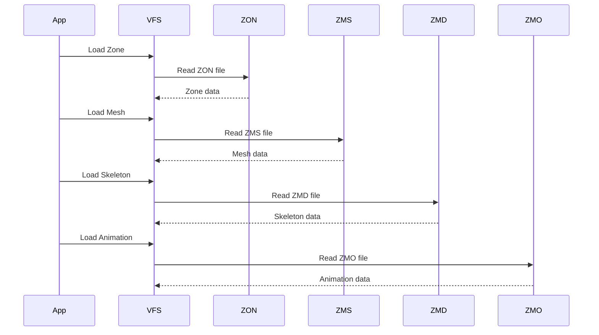
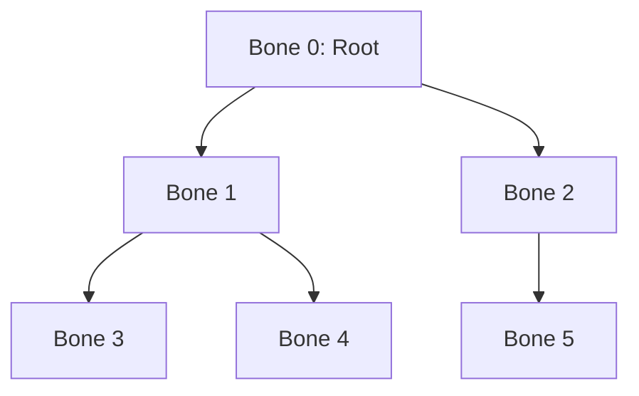
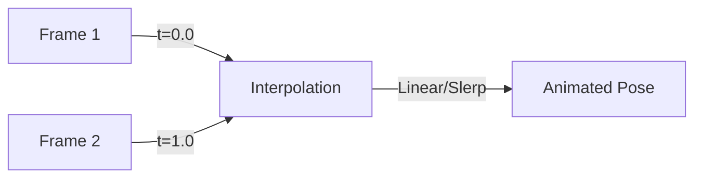
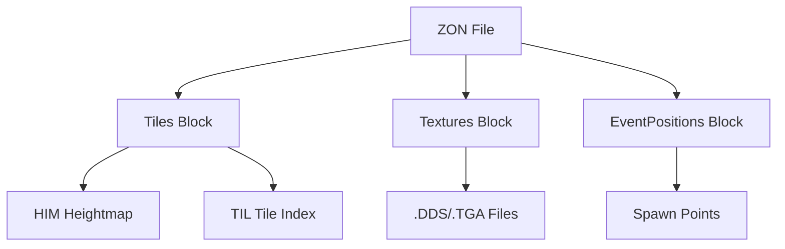

# rose-online-asset-file-technical-specs.md

# Rose Online Asset File Format Technical Specification
Rose Online Asset File Technical Specs
## Document Overview

This comprehensive technical specification document provides a definitive implementation guide for creating a high-fidelity Blender Python plugin to import Rose Online game assets. The document is based on reverse-engineered Rust source code from the Rose Offline project and the Bevy-based game client.

**Target Audience**: Blender plugin developers, 3D asset pipeline engineers, game asset researchers

**Primary Focus**: Data structures, binary parsing algorithms, and conversion to Blender's data model

---

## Table of Contents

1. [Introduction](#1-introduction)
2. [Core Systems](#2-core-systems)
3. [File Format Specifications](#3-file-format-specifications)
4. [Client-Side Rendering Pipeline](#4-client-side-rendering-pipeline)
5. [Blender Plugin Implementation Guide](#5-blender-plugin-implementation-guide)
6. [Code Examples and Reference Implementations](#6-code-examples-and-reference-implementations)
7. [Quick Reference](#7-quick-reference)
8. [Appendices](#8-appendices)

---

## 1. Introduction

### 1.1 Rose Online Asset System Overview

Rose Online uses a sophisticated asset management system organized around a Virtual Filesystem (VFS) architecture. Assets are stored in proprietary binary formats optimized for real-time rendering in the game engine.

#### Key Characteristics:

- **Coordinate System**: Y-up, centimeter-based (cm)
- **File Format Versions**: Multiple format versions with backward compatibility
- **Asset Organization**: Hierarchical structure with clear separation of concerns
- **Rendering Pipeline**: GPU-accelerated with skinned mesh support

#### Asset File Extensions:

| Extension | Description | Primary Use |
|------------|-------------|--------------|
| `.zms` | Mesh geometry | Character models, objects, terrain tiles |
| `.zmd` | Skeleton definition | Bone hierarchies for skinned meshes |
| `.zmo` | Motion/animation | Character animations, object animations |
| `.zon` | Zone definition | Terrain composition, grid system |
| `.zsc` | Object composition | Multi-part object assembly |
| `.ifo` | Zone object placement | NPC spawns, objects, events |
| `.him` | Heightmap | Terrain elevation data |
| `.til` | Tile index | Terrain tile mapping |
| `.chr` | Character definition | NPC and character asset references |

### 1.2 File Format Relationships

```mermaid
graph TD
    ZON[ZON Zone File] -->|References| TIL[TIL Tile Index]
    ZON -->|Uses| HIM[HIM Heightmap]
    ZON -->|Contains| Tiles[Tiles Block]
    
    IFO[IFO Zone Object File] -->|Instantiates| ZSC[ZSC Object Files]
    IFO -->|References| CHR[CHR Character File]
    IFO -->|Places| Objects[Zone Objects]
    
    CHR -->|References| ZMD[ZMD Skeleton]
    CHR -->|References| ZSC
    CHR -->|References| ZMO[ZMO Animation]
    CHR -->|Maps| Motions[Motion Actions]
    
    ZSC -->|Contains| ZMS[ZMS Mesh]
    ZSC -->|Contains| Materials[ZSC Materials]
    ZSC -->|Defines| Parts[Object Parts]
    ZSC -->|Contains| Effects[Effect References]
    
    ZMS -->|Requires| ZMD
    ZMS -->|Contains| Vertices[Vertex Data]
    ZMS -->|Contains| Indices[Index Data]
    ZMS -->|Contains| BoneWeights[Bone Weights]
    
    ZMO -->|Targets| ZMD bones
    ZMO -->|Contains| Channels[Animation Channels]
    ZMO -->|Contains| FrameEvents[Frame Events]
    ZMO -->|Extended| EZMO[EZMO/3ZMO]
    
    ZMD -->|Contains| Bones[Regular Bones]
    ZMD -->|Contains| DummyBones[Dummy Bones]
    
    HIM -->|Provides| Heights[Terrain Heights]
    TIL -->|Provides| Indices[Tile Indices]
```

#### Complete Asset Loading Workflows

##### Zone Loading and Composition Workflow:

```
1. Load ZON File
   ├─ Parse ZoneInfo block (grid configuration)
   ├─ Parse EventPositions block (spawn points)
   ├─ Parse Textures block (texture paths)
   └─ Parse Tiles block (tile composition)

2. Load Terrain Data
   ├─ Load HIM file (heightmap)
   ├─ Load TIL file (tile indices)
   └─ Generate terrain mesh from ZON tiles + HIM heights

3. Load IFO File
   ├─ Parse object blocks (NPCs, monsters, decorations)
   ├─ Parse spawn points
   ├─ Parse warp positions
   └─ Parse water planes

4. Load Zone Objects
   ├─ For each IFO object:
   │  ├─ Load ZSC file (object composition)
   │  ├─ For each ZSC part:
   │  │  ├─ Load ZMS mesh file
   │  │  ├─ Load ZSC material
   │  │  ├─ Apply material to mesh
   │  │  └─ Parent to object entity
   │  └─ For each ZSC effect:
   │     └─ Load and spawn effect
   └─ Place object at IFO position with transform
```

##### Character/NPC Assembly Pipeline:

```
1. Load CHR File
   ├─ Parse skeleton file list
   ├─ Parse motion file list
   ├─ Parse effect file list
   └─ Parse character definitions

2. For Character/NPC:
   ├─ Load ZMD skeleton file
   │  ├─ Parse bone hierarchy
   │  ├─ Create bone entities
   │  ├─ Compute bind pose matrices
   │  ├─ Compute inverse bind matrices
   │  └─ Create SkinnedMesh component
   │
   ├─ Load ZSC object files (one per body part)
   │  ├─ For each ZSC object:
   │  │  ├─ Parse material definitions
   │  │  ├─ Parse object parts
   │  │  ├─ Parse effect definitions
   │  │  └─ Load ZMS mesh files
   │
   ├─ Load ZMS mesh files
   │  ├─ Parse vertex data (positions, normals, UVs)
   │  ├─ Parse bone weights and indices
   │  ├─ Parse index data
   │  └─ Create mesh entities
   │
   ├─ Bind meshes to skeleton
   │  ├─ Attach to bone entities (or dummy bones)
   │  ├─ Apply SkinnedMesh component
   │  └─ Set material properties
   │
   ├─ Load ZMO animation files
   │  ├─ Parse frame data
   │  ├─ Parse channel data (position, rotation, scale)
   │  ├─ Parse frame events
   │  └─ Create animation handles
   │
   └─ Attach effects to dummy bones
      ├─ Load effect files from CHR
      ├─ Spawn effect entities
      └─ Parent to dummy bone entities
```

##### Animation Application Pipeline:

```
1. Load ZMO Animation File
   ├─ Parse FPS and frame count
   ├─ Parse channel definitions
   ├─ Parse frame data per channel
   └─ Parse frame events

2. Create ZmoAsset
   ├─ Organize channels by bone ID
   ├─ Store translation vectors per frame
   ├─ Store rotation quaternions per frame
   ├─ Store scale values per frame
   └─ Store frame events

3. Animation Playback
   ├─ Calculate current frame from time
   ├─ Get frame fraction for interpolation
   ├─ Sample bone transforms:
   │  ├─ Position: Linear interpolation
   │  ├─ Rotation: Quaternion slerp
   │  └─ Scale: Linear interpolation
   ├─ Apply transforms to bone entities
   └─ Trigger frame events

4. Skinned Mesh Update
   ├─ GPU computes vertex positions
   ├─ Using bone weights and current pose
   ├─ Apply skinning matrices
   └─ Render final mesh
```

#### Detailed File Type Interactions:

##### ZON ↔ HIM/TIL Interaction:

**Purpose**: Generate terrain geometry from zone definition

**Data Flow**:
```
ZON File:
  ├─ Grid per patch (float)
  ├─ Grid size (float)
  ├─ Tile textures (array of paths)
  └─ Tiles (array of ZonTile)
     ├─ Layer1 texture index
     ├─ Layer2 texture index
     ├─ Offset1, Offset2 (UV offsets)
     ├─ Blend flag
     └─ Rotation enum

HIM File:
  ├─ Width, Height (grid dimensions)
  └─ Heights array (width × height floats)

TIL File:
  ├─ Width, Height (grid dimensions)
  └─ Tiles array (width × height indices)

Terrain Generation:
  For each grid cell (x, y):
    ├─ Get tile index from TIL[x][y]
    ├─ Get tile definition from ZON.tiles[tile_index]
    ├─ Get texture path from ZON.textures[tile.layer1]
    ├─ Get height from HIM[x][y]
    ├─ Apply tile rotation and offset
    ├─ Generate vertices with height
    └─ Apply texture coordinates
```

**Client Implementation** (observed in rendering code):
- Terrain is rendered as a grid of tiles
- Each tile is a quad with 4 vertices
- Vertices are positioned using HIM heights
- UVs are computed from TIL tile indices and ZON tile data
- Layer blending is applied if tile.blend is true

##### IFO ↔ ZSC/ZMS/ZMD Interaction:

**Purpose**: Place objects in zone with correct models and transforms

**Data Flow**:
```
IFO File:
  ├─ Object type (Deco, NPC, MonsterSpawn, etc.)
  ├─ Object ID (references CHR or ZSC)
  ├─ Position (X, Y, Z)
  ├─ Rotation (quaternion XYZW)
  ├─ Scale (X, Y, Z)
  └─ Additional type-specific data

For NPC Objects:
  ├─ Load CHR file by NPC ID
  │  ├─ Get skeleton file path
  │  ├─ Get model IDs
  │  ├─ Get motion IDs
  │  └─ Get effect IDs
  │
  ├─ Load ZMD skeleton
  ├─ Load ZSC model files (from CHR.model_ids)
  │  └─ For each ZSC object:
  │     ├─ Load ZMS meshes
  │     ├─ Load materials
  │     └─ Create mesh entities
  │
  └─ Load ZMO animations (from CHR.motion_ids)
     └─ Create animation handles

For Decoration Objects:
  ├─ Load ZSC file directly (from IFO.object_id)
  └─ Same process as above
```

**Client Implementation** (from model_loader.rs):
```rust
// NPC spawning (lines 199-336)
pub fn spawn_npc_model(...) {
    // 1. Load CHR data
    let npc_model_data = self.npc_chr.npcs.get(&npc_id.get())?;
    
    // 2. Load skeleton
    let skeleton = self.vfs.read_file::<ZmdFile, _>(skeleton_path)?;
    let skinned_mesh = spawn_skeleton(commands, model_entity, &skeleton, ...);
    
    // 3. Load and spawn model parts
    for model_id in npc_model_data.model_ids.iter() {
        let parts = spawn_model(
            commands,
            asset_server,
            object_materials,
            model_entity,
            &self.npc_zsc,  // ZSC file
            *model_id as usize,
            Some(&skinned_mesh),  // Bind to skeleton
            None,
            dummy_bone_offset,
            false,
            &self.specular_image,
        );
        model_parts.append(&mut parts);
    }
    
    // 4. Attach effects to dummy bones
    for (link_dummy_bone_id, effect_id) in npc_model_data.effect_ids.iter() {
        let dummy_bone_entity = skinned_mesh.joints[dummy_bone_offset + *link_dummy_bone_id];
        let effect_entity = spawn_effect(...);
        commands.entity(dummy_bone_entity).add_child(effect_entity);
    }
    
    // 5. Load animations
    let action_motions = enum_map! {
        action => asset_server.load(motion_data.path)
    };
}
```

##### CHR ↔ ZMD/ZSC/ZMO Interaction:

**Purpose**: Define character/NPC asset composition and animations

**Data Flow**:
```
CHR File:
  ├─ Skeleton files (array of paths)
  ├─ Motion files (array of paths)
  ├─ Effect files (array of paths)
  └─ Character definitions (map: ID → NpcModelData)

NpcModelData:
  ├─ Skeleton index (into skeleton_files)
  ├─ Name
  ├─ Model IDs (array: into ZSC objects)
  ├─ Motion IDs (array of tuples: (motion_id, file_index))
  └─ Effect IDs (array of tuples: (motion_id, file_index))
```

**Character Assembly** (from model_loader.rs lines 660-730):
```rust
pub fn spawn_character_model(...) {
    // 1. Load skeleton for gender
    let skeleton = self.get_skeleton(character_info.gender);
    let dummy_bone_offset = skeleton.bones.len();
    let skinned_mesh = spawn_skeleton(commands, model_entity, skeleton, ...);
    
    // 2. For each body part (face, hair, head, body, etc.)
    for model_part in [CharacterFace, CharacterHair, Head, Body, ...] {
        // 3. Get model ID from equipment
        let model_id = get_model_part_index(&self.item_database, character_info, equipment, model_part);
        
        // 4. Load ZSC file for this body part
        let model_list = self.get_model_list(character_info.gender, model_part);
        
        // 5. Spawn model parts
        let parts = self.spawn_character_model_part(
            character_info,
            model_part,
            commands,
            asset_server,
            object_materials,
            model_entity,
            model_id.id,
            &skinned_mesh,  // Bind to skeleton
            dummy_bone_offset,
            equipment,
            particle_materials,
            effect_mesh_materials,
        );
        
        model_parts[model_part] = (model_id, parts);
    }
    
    // 6. Load action motions (animations)
    let action_motions = self.load_character_action_motions(asset_server, character_info, equipment);
    
    return (CharacterModel { model_parts, action_motions, ... }, skinned_mesh, ...);
}
```

##### ZSC ↔ ZMS/Material Interaction:

**Purpose**: Define multi-part objects with materials and transforms

**Data Flow**:
```
ZSC File:
  ├─ Meshes (array of paths to ZMS files)
  ├─ Materials (array of ZscMaterial)
  ├─ Effects (array of paths to effect files)
  └─ Objects (array of ZscObject)

ZscObject:
  └─ Parts (array of ZscObjectPart)

ZscObjectPart:
  ├─ Mesh ID (into meshes array)
  ├─ Material ID (into materials array)
  ├─ Transform (position, rotation, scale)
  ├─ Bone index (optional: bind to skeleton bone)
  ├─ Dummy index (optional: bind to dummy bone)
  ├─ Parent index (optional: parent part)
  └─ Animation path (optional: animation override)

ZscMaterial:
  ├─ Path (texture file)
  ├─ Alpha enabled, two-sided
  ├─ Alpha test (threshold)
  ├─ Z write/test enabled
  ├─ Blend mode
  ├─ Specular enabled
  ├─ Alpha value
  └─ Glow type and color
```

**Client Implementation** (from model_loader.rs lines 1180-1277):
```rust
fn spawn_model(...) {
    let object = model_list.objects.get(model_id)?;
    
    for object_part in object.parts.iter() {
        // 1. Load ZMS mesh
        let mesh = asset_server.load(model_list.meshes[mesh_id].path());
        
        // 2. Load ZSC material
        let zsc_material = &model_list.materials[material_id];
        let material = object_materials.add(ObjectMaterial {
            base_texture: asset_server.load(zsc_material.path),
            alpha_value: zsc_material.alpha,
            alpha_enabled: zsc_material.alpha_enabled,
            alpha_test: zsc_material.alpha_test,
            two_sided: zsc_material.two_sided,
            z_write_enabled: zsc_material.z_write_enabled,
            z_test_enabled: zsc_material.z_test_enabled,
            specular_texture: if zsc_material.specular_enabled { ... },
            skinned: zsc_material.is_skin,
        });
        
        // 3. Create mesh entity
        let entity = commands.spawn((mesh, material, Transform::default())).id();
        
        // 4. Bind to skeleton bone or dummy bone
        let link_bone_entity = if let Some(skinned_mesh) = skinned_mesh {
            if let Some(bone_index) = object_part.bone_index {
                skinned_mesh.joints[bone_index]  // Regular bone
            } else if let Some(dummy_index) = object_part.dummy_index {
                skinned_mesh.joints[dummy_index + dummy_bone_offset]  // Dummy bone
            } else if let Some(default_bone) = default_bone_index {
                skinned_mesh.joints[default_bone]  // Default bone
            } else {
                None
            }
        } else {
            None
        };
        
        // 5. Parent mesh to bone or model entity
        commands.entity(link_bone_entity.unwrap_or(model_entity)).add_child(entity);
    }
}
```

##### ZMO ↔ ZMD Interaction:

**Purpose**: Drive skeleton bones with animation data

**Data Flow**:
```
ZMO File:
  ├─ FPS (frames per second)
  ├─ Frame count
  ├─ Channels (array of (bone_id, channel_type))
  └─ Frame events (array of frame numbers)

ZmoChannel Types:
  ├─ Position: Vec3 per frame
  ├─ Rotation: Quat4 per frame
  ├─ Scale: f32 per frame
  ├─ Normal: Vec3 per frame (morph targets)
  ├─ UV1-UV4: Vec2 per frame (texture animation)
  ├─ Alpha: f32 per frame
  └─ Texture: f32 per frame
```

**Client Implementation** (from zmo_asset_loader.rs lines 133-218):
```rust
impl AssetLoader for ZmoAssetLoader {
    fn load(...) {
        // 1. Parse ZMO file
        let zmo = <ZmoFile as RoseFile>::read((&bytes).into(), &Default::default())?;
        
        // 2. Determine max bone ID from channels
        let mut max_bone_id = 0;
        for (bone_id, _) in zmo.channels.iter() {
            max_bone_id = max_bone_id.max(*bone_id);
        }
        
        // 3. Create bone animation arrays
        let mut bones = vec![ZmoAssetBone::default(); (max_bone_id + 1) as usize];
        
        // 4. Populate bone data from channels
        for (channel_id, (bone_id, channel)) in zmo.channels.iter().enumerate() {
            let bone_animation = &mut bones[*bone_id as usize];
            match channel {
                ZmoChannel::Position(positions) => {
                    // Convert coordinates: (x, y, z) → (x, z, -y) / 100.0
                    bone_animation.translation = positions.iter().map(|position| {
                        Vec3::new(position.x, position.z, -position.y) / 100.0
                    }).collect();
                }
                ZmoChannel::Rotation(rotations) => {
                    // Convert quaternion: (x, y, z, w) → (x, z, -y, w)
                    bone_animation.rotation = rotations.iter().map(|rotation| {
                        Quat::from_xyzw(
                            rotation.x,
                            rotation.z,
                            -rotation.y,
                            rotation.w,
                        )
                    }).collect();
                }
                ZmoChannel::Scale(scales) => {
                    bone_animation.scale = scales.clone();
                }
                _ => {}
            }
        }
        
        // 5. Create ZmoAsset
        Ok(ZmoAsset {
            num_frames: zmo.num_frames,
            fps: zmo.fps,
            bones,
            frame_events: zmo.frame_events,
            interpolation_interval: (zmo.interpolation_interval_ms.unwrap_or(500) as f32 / 1000.0).max(0.0001),
            animation_texture: None,
        })
    }
}
```

**Animation Sampling** (from zmo_asset_loader.rs lines 70-120):
```rust
impl ZmoAsset {
    // Sample translation with linear interpolation
    pub fn sample_translation(&self, channel_id, current_frame_fract,
                           current_frame_index, next_frame_index) -> Option<Vec3> {
        let current = self.get_translation(channel_id, current_frame_index);
        let next = self.get_translation(channel_id, next_frame_index);
        
        if let (Some(current), Some(next)) = (current, next) {
            Some(current.lerp(next, current_frame_fract))  // Linear interpolation
        } else {
            None
        }
    }
    
    // Sample rotation with spherical linear interpolation
    pub fn sample_rotation(&self, channel_id, current_frame_fract,
                       current_frame_index, next_frame_index) -> Option<Quat> {
        let current = self.get_rotation(channel_id, current_frame_index);
        let next = self.get_rotation(channel_id, next_frame_index);
        
        if let (Some(current), Some(next)) = (current, next) {
            Some(current.slerp(next, current_frame_fract))  // Quaternion slerp
        } else {
            None
        }
    }
}
```

##### ZMS ↔ ZMD Interaction:

**Purpose**: Bind mesh vertices to skeleton bones for skinning

**Data Flow**:
```
ZMS File:
  ├─ Format flags (vertex attributes)
  ├─ Bone count
  ├─ Bone mapping (version 5/6 only)
  ├─ Vertex count
  ├─ Vertex data (based on flags):
  │  ├─ Positions (Vec3)
  │  ├─ Normals (Vec3)
  │  ├─ Colors (Vec4)
  │  ├─ Bone weights (Vec4: w1, w2, w3, w4)
  │  ├─ Bone indices (Vec4: i1, i2, i3, i4)
  │  ├─ Tangents (Vec3)
  │  └─ UV1-UV4 (Vec2)
  ├─ Triangle indices (u16)
  └─ Material face counts (u16)
```

**Client Implementation** (from model_loader.rs lines 1107-1177):
```rust
fn spawn_skeleton(commands, model_entity, skeleton, ...) -> SkinnedMesh {
    // 1. Create bone entities with bind pose transforms
    let mut bind_pose = Vec::new();
    let mut bone_entities = Vec::new();
    let dummy_bone_offset = skeleton.bones.len();
    
    for bone in skeleton.bones.iter().chain(skeleton.dummy_bones.iter()) {
        // Convert position: (x, y, z) → (x, z, -y) / 100.0
        let position = Vec3::new(bone.position.x, bone.position.z, -bone.position.y) / 100.0;
        
        // Convert rotation: (w, x, y, z) → (x, z, -y, w)
        let rotation = Quat::from_xyzw(
            bone.rotation.x,
            bone.rotation.z,
            -bone.rotation.y,
            bone.rotation.w,
        );
        
        let transform = Transform::default()
            .with_translation(position)
            .with_rotation(rotation);
        
        bind_pose.push(transform);
        
        bone_entities.push(commands.spawn((transform, ...)).id());
    }
    
    // 2. Apply parent-child hierarchy to compute bind pose
    transform_children(skeleton, &mut bind_pose, 0);
    
    // 3. Compute inverse bind matrices for skinning
    let inverse_bind_pose: Vec<Mat4> = bind_pose.iter()
        .map(|x| x.compute_matrix().inverse())
        .collect();
    
    // 4. Create SkinnedMesh component with inverse bind matrices
    SkinnedMesh {
        inverse_bindposes: skinned_mesh_inverse_bindposes_assets
            .add(SkinnedMeshInverseBindposes::from(inverse_bind_pose)),
        joints: bone_entities,
    }
}
```

**ZMS Mesh Binding** (from model_loader.rs lines 1244-1274):
```rust
// In spawn_model function:
if zsc_material.is_skin {
    // 1. Attach SkinnedMesh component to mesh entity
    if let Some(skinned_mesh) = skinned_mesh {
        entity_commands.insert(skinned_mesh.clone());
    }
}

// 2. Parent mesh to bone entity
let link_bone_entity = if let Some(skinned_mesh) = skinned_mesh {
    if let Some(bone_index) = object_part.bone_index {
        skinned_mesh.joints[bone_index as usize]  // Regular bone
    } else if let Some(dummy_index) = object_part.dummy_index {
        skinned_mesh.joints[dummy_index as usize + dummy_bone_offset]  // Dummy bone
    } else if let Some(default_bone) = default_bone_index {
        skinned_mesh.joints[default_bone]  // Default bone
    } else {
        None
    }
} else {
    None
};

commands.entity(link_bone_entity.unwrap_or(model_entity)).add_child(entity);
```

**GPU Skinning**:
```
For each vertex:
  final_position = (0, 0, 0)
  
  for i in 0..4:
    weight = vertex.bone_weights[i]
    bone_index = vertex.bone_indices[i]
    
    if weight > 0:
      bone_matrix = current_pose_matrices[bone_index]
      inverse_bind = inverse_bind_matrices[bone_index]
      skinning_matrix = bone_matrix × inverse_bind
      
      final_position += weight × (skinning_matrix × vertex.position)
  
  render_vertex(final_position)
```

##### Effect System Integration:

**Purpose**: Attach particle and mesh effects to objects

**Data Flow**:
```
CHR File:
  └─ Effect IDs (array of tuples: (motion_id, file_index))

ZSC File:
  └─ Effects (array of paths to effect files)

Client Implementation:
  For each effect:
    ├─ Load effect file
    ├─ Create effect entity
    ├─ Parent to dummy bone entity
    └─ Effect system renders particles/meshes
```

**Client Implementation** (from model_loader.rs lines 257-278, 520-574):
```rust
// NPC effect attachment
for (link_dummy_bone_id, effect_id) in npc_model_data.effect_ids.iter() {
    if let Some(effect_path) = self.npc_chr.effect_files.get(*effect_id as usize) {
        if let Some(dummy_bone_entity) = skinned_mesh.joints
            .get(dummy_bone_offset + *link_dummy_bone_id as usize)
        {
            if let Some(effect_entity) = spawn_effect(
                &self.vfs,
                commands,
                asset_server,
                particle_materials,
                effect_mesh_materials,
                effect_path.into(),
                false,
                None,
            ) {
                commands.entity(dummy_bone_entity).add_child(effect_entity);
                model_parts.push(effect_entity);
            }
        }
    }
}

// Character gem effect attachment
fn spawn_character_gem_effect(...) {
    let gem_item = self.item_database.get_gem_item(gem_item_number)?;
    let gem_effect_id = gem_item.gem_effect_id?;
    let gem_effect = self.effect_database.get_effect(gem_effect_id)?;
    let effect_file_id = gem_effect.point_effects.get(0)?;
    let effect_file = self.effect_database.get_effect_file(*effect_file_id)?;
    
    let zsc_object = model_list.objects.get(item_model_id)?;
    let gem_effect_point = zsc_object.effects.get(gem_position)?;
    let parent_part_entity = model_parts.get(gem_effect_point.parent.unwrap_or(0) as usize)?;
    
    let effect_entity = spawn_effect(...)?;
    
    commands.entity(parent_part_entity).add_child(effect_entity);
    
    // Apply transform to effect
    commands.entity(effect_entity).insert(
        Transform::from_translation(
            Vec3::new(
                gem_effect_point.position.x,
                gem_effect_point.position.z,
                -gem_effect_point.position.y,
            ) / 100.0
        ).with_rotation(Quat::from_xyzw(
            gem_effect_point.rotation.x,
            gem_effect_point.rotation.z,
            -gem_effect_point.rotation.y,
            gem_effect_point.rotation.w,
        ))
    );
}
```

##### Vehicle Assembly Pipeline:

**Purpose**: Assemble vehicle models with skeleton and parts

**Data Flow**:
```
Vehicle Item Database:
  └─ Vehicle item data
     ├─ Vehicle type (Cart/CastleGear)
     ├─ Base motion index
     ├─ Base avatar motion index
     └─ Dummy effect file IDs

Client Implementation (model_loader.rs lines 915-1060):
pub fn spawn_vehicle_model(...) {
    // 1. Determine skeleton type
    let skeleton = match body_item_data.vehicle_type {
        VehicleType::Cart => &self.skeleton_cart,
        VehicleType::CastleGear => &self.skeleton_castle_gear,
    };
    
    // 2. Spawn skeleton
    let skinned_mesh = spawn_skeleton(commands, vehicle_model_entity, skeleton, ...);
    
    // 3. Load vehicle ZSC
    let mut model_parts = EnumMap::default();
    
    for vehicle_part_index in [Body, Engine, Leg, Arms] {
        if let Some(model_id) = equipment.equipped_vehicle[vehicle_part_index] {
            // 4. Spawn model part
            model_parts[vehicle_part_index] = (
                model_id,
                spawn_model(commands, asset_server, object_materials,
                         vehicle_model_entity, &self.vehicle, model_id,
                         Some(&skinned_mesh), None, dummy_bone_offset, false, ...),
            );
            
            // 5. Attach dummy effects
            if let Some(item_data) = self.item_database.get_vehicle_item(model_id) {
                for (dummy_index, effect_file_id) in item_data.dummy_effect_file_ids.iter().enumerate() {
                    if let Some(effect_path) = effect_file_id.and_then(|id|
                        self.effect_database.get_effect_file(id)) {
                        if let Some(dummy_bone_entity) =
                            skinned_mesh.joints.get(dummy_bone_offset + dummy_index) {
                            if let Some(effect_entity) = spawn_effect(...) {
                                commands.entity(dummy_bone_entity).add_child(effect_entity);
                                model_parts[vehicle_part_index].1.push(effect_entity);
                            }
                        }
                    }
                }
            }
        }
    }
    
    // 6. Load vehicle and driver animations
    let vehicle_action_motions = enum_map! {
        action => asset_server.load(motion_data.path)
    };
    let character_action_motions = enum_map! {
        action => asset_server.load(motion_data.path)
    };
}
```

#### Client-Side Rendering Integration Summary:

The Rose Offline client (Bevy-based) integrates all file types through a hierarchical asset loading system:

1. **VFS Layer**: Unified file access across packed archives and host filesystem
2. **Asset Server**: Asynchronous loading and caching of assets
3. **ECS Components**:
   - `SkinnedMesh`: Bone binding data (inverse bind matrices, joint entities)
   - `CharacterModel`: Character parts and animation handles
   - `NpcModel`: NPC-specific data
   - `VehicleModel`: Vehicle-specific data
   - `ObjectMaterial`: Material properties and textures
4. **Systems**: Update bone poses, apply animations, render skinned meshes
5. **GPU Skinning**: Bevy's built-in skinned mesh rendering uses inverse bind matrices

**Coordinate Transformations Applied in Client**:
- All positions: `(x, y, z) → (x, z, -y) / 100.0`
- All rotations: `(w, x, y, z) → (x, z, -y, w)`
- Scale: 100.0 (cm to m conversion)

**Blender Import Implications**:
1. Apply inverse coordinate transformations for Blender's coordinate system
2. Preserve bone hierarchy and parent-child relationships
3. Convert bone weights to vertex groups
4. Map frame-based animations to Blender actions
5. Convert materials to Principled BSDF nodes
6. Handle dummy bones as separate bone entities
7. Preserve animation events for Blender NLA tracks

### 1.3 Blender Integration Strategy

#### Conversion Goals:

1. **Coordinate System Conversion**: Rose Online (cm, Y-up) → Blender (m, Y-up)
2. **Data Model Mapping**: Binary structures → Blender Python API objects
3. **Hierarchy Preservation**: Bone and object relationships maintained
4. **Material Translation**: Rose Online materials → Blender Principled BSDF
5. **Animation Support**: Frame-based animation → Blender NLA tracks

#### Data Model Mapping:

| Rose Online Concept | Blender Equivalent |
|-------------------|-------------------|
| ZMS Mesh | bpy.types.Mesh |
| ZMD Skeleton | bpy.types.Armature |
| ZMD Bone | bpy.types.Bone |
| ZMO Animation | bpy.types.Action |
| ZSC Object | Collection of mesh objects |
| Material | bpy.types.Material |
| Bone Weights | Vertex Groups |

---

## 2. Core Systems

### 2.1 Virtual Filesystem (VFS) Abstraction Layer

#### Architecture Overview:

The VFS provides a unified interface for accessing game assets across multiple storage devices (packed archives, host filesystem).

#### Key Components:

```rust
// VFS Device Trait
trait VirtualFilesystemDevice {
    fn open_file(&self, path: &VfsPath) -> Result<VfsFile>;
    fn exists(&self, path: &VfsPath) -> bool;
}

// VFS Implementation
struct VirtualFilesystem {
    devices: Vec<Box<dyn VirtualFilesystemDevice + Send + Sync>>
}
```

#### Path Normalization:

All paths are normalized to:
- Forward slashes (`/`)
- Uppercase
- No leading/trailing whitespace
- No double slashes

Example: `3DDATA\AVATAR\MALE.ZMD` → `3DDATA/AVATAR/MALE.ZMD`

#### File Loading Mechanism:

```rust
// Generic file loading
vfs.read_file::<ZmsFile, _>("3DDATA/MODELS/CHARACTER.ZMS")?;

// With options
vfs.read_file_with::<ZonFile, _, _>("DATA/ZONES/01.ZON", &options)?;
```

#### Caching Strategy:

- Assets are loaded on-demand
- VFS devices are queried in order
- First successful read wins
- No built-in caching (handled by application layer)

### 2.2 Coordinate System Conversions

#### Rose Online Coordinate System:

- **Units**: Centimeters (cm)
- **Up Axis**: Y-up
- **Handedness**: Right-handed
- **Forward**: -Z direction
- **Right**: +X direction

#### Blender Coordinate System:

- **Units**: Meters (m)
- **Up Axis**: Y-up
- **Handedness**: Right-handed
- **Forward**: -Y direction (in view space)
- **Right**: +X direction

#### Conversion Formulas:

**Position Conversion**:

```python
# Rose Online (cm) to Blender (m)
def convert_position(x, y, z):
    return (x / 100.0, y / 100.0, z / 100.0)

# For client rendering (observed in model_loader.rs):
# Rose: (x, y, z) → Blender: (x, z, -y) / 100.0
def convert_position_for_client(x, y, z):
    return (x / 100.0, z / 100.0, -y / 100.0)
```

**Rotation Conversion**:

```python
# Rose Online quaternion (W, X, Y, Z) to Blender (W, X, Y, Z)
# Note: Some files store as WXYZ, others as XYZW
def convert_quaternion(w, x, y, z):
    # Blender uses (w, x, y, z)
    return (w, x, y, z)

# For client rendering (observed):
# Rose: (x, y, z, w) → Blender: (x, z, -y, w)
def convert_quaternion_for_client(x, y, z, w):
    return (x, z, -y, w)
```

**Scale Conversion**:

```python
# ZMS mesh data is scaled by 100.0
# ZMD bone positions are in cm
def convert_scale(value):
    return value / 100.0
```

#### Coordinate System Mappings:

| Rose Online Axis | Blender Axis | Notes |
|-----------------|---------------|-------|
| +X | +X | Same direction |
| +Y | +Z | Client rotates Y to Z |
| +Z | -Y | Client inverts Z to -Y |

### 2.3 Bone Binding Matrices and Skinning

#### Bone Hierarchy Structure:

Bones form a tree structure where each bone has a parent index (0 = root).

```rust
pub struct ZmdBone {
    pub parent: u16,        // Parent bone index (0 = root)
    pub position: Vec3<f32>,  // Position in parent space (cm)
    pub rotation: Quat4<f32>, // Rotation in parent space (WXYZ)
}
```

#### Bone-to-Vertex Binding System:

Each vertex can be bound to up to 4 bones with weights.

```rust
// Vertex bone binding data
pub bone_weights: Vec<[f32; 4]>,    // Weight for each of 4 bones
pub bone_indices: Vec<[u16; 4]>,    // Bone indices (mapped to skeleton)
```

**Weight Normalization**: The 4 weights should sum to 1.0 for proper skinning.

#### Skinning Transformation Pipeline:

1. **Bind Pose**: Bone positions at rest (from ZMD)
2. **Inverse Bind Matrix**: Pre-computed for each bone
3. **Current Pose**: Bone transformation from animation (ZMO)
4. **Skinning Matrix**: `CurrentPose × InverseBindMatrix`
5. **Vertex Transformation**: `Σ (Weight_i × SkinningMatrix_i × VertexPosition)`

#### Bone Pose Matrices and Bone Spaces:

**Bone Spaces**:
- **Local Space**: Position/rotation relative to parent
- **Object Space**: Position/rotation relative to mesh origin
- **World Space**: Position/rotation in game world

**Pose Matrix Calculation**:

```python
def compute_bone_pose_matrix(bone, parent_pose):
    # Local transformation matrix
    local_matrix = matrix_from_translation_rotation(
        bone.position,
        bone.rotation
    )
    
    # Object space matrix
    if bone.parent == 0:
        return local_matrix
    else:
        return parent_pose @ local_matrix
```

#### Vertex Position Calculation with Bone Weights:

```python
def compute_skinned_vertex(vertex, bone_indices, bone_weights, bone_matrices):
    result = Vector((0, 0, 0))
    
    for i in range(4):
        bone_idx = bone_indices[i]
        weight = bone_weights[i]
        
        if weight > 0 and bone_idx < len(bone_matrices):
            bone_matrix = bone_matrices[bone_idx]
            result += weight * (bone_matrix @ vertex)
    
    return result
```

### 2.4 Animation Track Interpolation

#### Frame-Based Animation System:

Animations are stored as discrete frames with fixed FPS.

```rust
pub struct ZmoFile {
    pub fps: usize,              // Frames per second (typically 30)
    pub num_frames: usize,       // Total frame count
    pub channels: Vec<(u32, ZmoChannel)>,  // (bone_index, channel_data)
    pub frame_events: Vec<u16>,  // Frame event triggers
    pub interpolation_interval_ms: Option<u32>,  // For 3ZMO format
}
```

#### Channel Types and Data Structures:

| Channel Type | Value | Data Type | Purpose |
|--------------|--------|-----------|---------|
| Empty | 1 | - | No animation data |
| Position | 2 | Vec3<f32> | Bone position |
| Rotation | 4 | Quat4<f32> | Bone rotation (WXYZ) |
| Normal | 8 | Vec3<f32> | Vertex normal |
| Alpha | 16 | f32 | Transparency |
| UV1 | 32 | Vec2<f32> | First UV set |
| UV2 | 64 | Vec2<f32> | Second UV set |
| UV3 | 128 | Vec2<f32> | Third UV set |
| UV4 | 256 | Vec2<f32> | Fourth UV set |
| Texture | 512 | f32 | Texture animation |
| Scale | 1024 | f32 | Scale factor |

#### Interpolation Algorithms:

**Linear Interpolation (Position, Scale, UVs)**:

```python
def lerp(a, b, t):
    return a + (b - a) * t

def interpolate_position(frame1, frame2, t):
    return lerp(frame1, frame2, t)
```

**Quaternion Slerp (Rotation)**:

```python
def slerp(q1, q2, t):
    # Spherical linear interpolation for quaternions
    dot = q1.w * q2.w + q1.x * q2.x + q1.y * q2.y + q1.z * q2.z
    
    if dot < 0:
        q2 = -q2
        dot = -dot
    
    if dot > 0.9995:
        return normalize(lerp(q1, q2, t))
    
    theta = acos(dot)
    sin_theta = sin(theta)
    
    w1 = sin((1 - t) * theta) / sin_theta
    w2 = sin(t * theta) / sin_theta
    
    return normalize(w1 * q1 + w2 * q2)
```

#### Frame Blending and Weight Calculation:

```python
def get_animation_frame(zmo_file, time_seconds):
    fps = zmo_file.fps
    total_frames = zmo_file.num_frames
    
    frame_time = 1.0 / fps
    total_time = total_frames * frame_time
    
    # Loop animation
    time_seconds = time_seconds % total_time
    
    frame_index = int(time_seconds / frame_time)
    frame_fraction = (time_seconds % frame_time) / frame_time
    
    frame1 = frame_index % total_frames
    frame2 = (frame_index + 1) % total_frames
    
    return frame1, frame2, frame_fraction
```

#### Frame Events and Interpolation Intervals:

**Frame Events**:
- Triggered at specific frames
- Used for sound effects, particle spawns, etc.
- Event IDs: 10, 20-28, 56-57, 66-67 (attack events)

**3ZMO Extended Format**:
- Includes `interpolation_interval_ms` field
- Specifies custom interpolation timing
- Allows for variable frame rates

#### Loop Count and Playback Control:

```python
def get_animation_duration(zmo_file):
    return zmo_file.num_frames / zmo_file.fps

def get_loop_count(zmo_file, total_time):
    duration = get_animation_duration(zmo_file)
    return int(total_time / duration)
```

### 2.5 Material System

#### Material Properties and Flags:

```rust
pub struct ZscMaterial {
    pub path: VfsPathBuf,              // Material file path
    pub is_skin: bool,                 // Skin/shader type
    pub alpha_enabled: bool,            // Transparency enabled
    pub two_sided: bool,                // Double-sided rendering
    pub alpha_test: Option<f32>,        // Alpha test threshold
    pub z_write_enabled: bool,           // Depth write
    pub z_test_enabled: bool,           // Depth test
    pub blend_mode: ZscMaterialBlend,   // Blending mode
    pub specular_enabled: bool,           // Specular highlights
    pub alpha: f32,                    // Global alpha
    pub glow: Option<ZscMaterialGlow>, // Glow effect
}
```

#### Blend Modes and Transparency:

| Blend Mode | Value | Description | Blender Equivalent |
|------------|--------|-------------|-------------------|
| Normal | 0 | Standard alpha blending | Alpha Blend |
| Lighten | 1 | Additive blending | Add Mix |

**Alpha Test**:
- Threshold value (0-1) for pixel discard
- Typical value: `alpha_ref / 256.0`
- Pixels below threshold are discarded

#### Alpha Testing and Depth Testing:

```python
# Depth testing
if not material.z_test_enabled:
    # Disable depth test
    pass

# Depth writing
if not material.z_write_enabled:
    # Disable depth write
    pass

# Alpha testing
if material.alpha_test is not None:
    threshold = material.alpha_test
    if pixel_alpha < threshold:
        discard_pixel()
```

#### Glow Effects and Shader Integration:

```rust
pub enum ZscMaterialGlow {
    Simple(Vec3<f32>),      // Simple glow color
    Light(Vec3<f32>),        // Light-based glow
    Texture(Vec3<f32>),      // Texture-based glow
    TextureLight(Vec3<f32>), // Texture + light glow
    Alpha(Vec3<f32>),        // Alpha-based glow
}
```

#### Texture Referencing and UV Mapping:

**UV Channels**:
- ZMS supports up to 4 UV sets (UV1-UV4)
- UV1 is primary texture coordinates
- UV2-UV4 used for multi-texturing or effects

**Texture Paths**:
- Stored in ZSC material definitions
- Resolved through VFS
- File extensions: `.dds`, `.tga`, `.jpg`

#### WGSL Shader Compilation:

The Bevy client uses WGSL shaders for rendering. Material properties are compiled into shader uniforms.

### 2.6 Vertex Format Flags and Data Layout

#### ZmsFormatFlags Bitfield Structure:

```rust
bitflags! {
    pub struct ZmsFormatFlags: u32 {
        const POSITION = (1 << 1);      // 0x0002
        const NORMAL = (1 << 2);        // 0x0004
        const COLOR = (1 << 3);         // 0x0008
        const BONE_WEIGHT = (1 << 4);   // 0x0010
        const BONE_INDEX = (1 << 5);    // 0x0020
        const TANGENT = (1 << 6);       // 0x0040
        const UV1 = (1 << 7);          // 0x0080
        const UV2 = (1 << 8);          // 0x0100
        const UV3 = (1 << 9);          // 0x0200
        const UV4 = (1 << 10);         // 0x0400
    }
}
```

#### Vertex Attribute Variations:

**Version 5/6 (Legacy)**:
- Each vertex preceded by 32-bit vertex ID
- Bone indices stored as 32-bit, mapped to 16-bit
- Position scaled by 100.0 (cm to m conversion)

**Version 7/8 (Modern)**:
- No vertex IDs
- Bone indices stored as 16-bit directly
- No scaling (already in correct units)

#### Position, Normal, Color, Bone Weights:

```rust
pub position: Vec<[f32; 3]>,      // X, Y, Z position
pub normal: Vec<[f32; 3]>,        // X, Y, Z normal vector
pub color: Vec<[f32; 4]>,         // R, G, B, A vertex color
pub bone_weights: Vec<[f32; 4]>,   // Weight for 4 bones
pub bone_indices: Vec<[u16; 4]>,    // Bone index mapping
```

#### UV Coordinate Sets (UV1-4):

```rust
pub uv1: Vec<[f32; 2]>,  // Primary UV coordinates
pub uv2: Vec<[f32; 2]>,  // Secondary UV coordinates
pub uv3: Vec<[f32; 2]>,  // Tertiary UV coordinates
pub uv4: Vec<[f32; 2]>,  // Quaternary UV coordinates
```

#### Tangent and Binormal Data:

```rust
pub tangent: Vec<[f32; 3]>,  // Tangent vector for normal mapping
```

Note: Binormals can be computed from tangent and normal:
```python
binormal = cross(normal, tangent)
```

#### Material Face Mapping:

```rust
pub material_num_faces: Vec<u16>,  // Face count per material
```

Faces are grouped by material index for efficient rendering.

---

## 3. File Format Specifications

### 3.1 ZMS Mesh Files (.zms)

#### File Header and Magic Number:

```
Offset  Type    Description
0x00    char[7]  Magic string ("ZMS0005", "ZMS0006", "ZMS0007", "ZMS0008")
```

#### Version Detection:

| Magic String | Version | Notes |
|--------------|----------|-------|
| ZMS0005 | 5 | Legacy format |
| ZMS0006 | 6 | Legacy format with material mapping |
| ZMS0007 | 7 | Modern format |
| ZMS0008 | 8 | Modern format with strip indices |

#### Binary Layout and Data Structures:

**Version 5/6 Layout**:

```
Offset  Type    Description
0x00    char[7]  Magic string
0x07    u32      Format flags (ZmsFormatFlags)
0x0B    Vec3     Bounding box minimum
0x17    Vec3     Bounding box maximum
0x23    u32      Bone count
0x27    u32[]    Bone mapping (bone_count × 4 bytes)
0x??    u32      Vertex count
0x??    Vertex[]  Vertex data (based on format flags)
0x??    u32      Triangle count
0x??    u16[]    Index data (triangle_count × 3)
0x??    u32      Material ID count (version 6+)
0x??    u16[]    Material face counts
```

**Version 7/8 Layout**:

```
Offset  Type    Description
0x00    char[7]  Magic string
0x07    u32      Format flags (ZmsFormatFlags)
0x0B    Vec3     Bounding box minimum
0x17    Vec3     Bounding box maximum
0x23    u16      Bone count
0x25    u16[]    Bone indices (bone_count × 2 bytes)
0x??    u16      Vertex count
0x??    Vertex[]  Vertex data (based on format flags)
0x??    u16      Triangle count
0x??    u16[]    Index data (triangle_count × 3)
0x??    u16      Material ID count
0x??    u16[]    Material face counts
0x??    u16      Strip index count (version 8)
0x??    u16[]    Strip indices
0x??    u16      Pool type (version 8)
```

#### Vertex Data Arrays:

**Vertex Data Structure** (per vertex):

```c
struct Vertex {
    // Present if POSITION flag set
    float position[3];  // X, Y, Z
    
    // Present if NORMAL flag set
    float normal[3];    // X, Y, Z
    
    // Present if COLOR flag set
    float color[4];     // R, G, B, A
    
    // Present if BONE_WEIGHT and BONE_INDEX flags set
    float bone_weight[4];   // W1, W2, W3, W4
    uint32 bone_index[4];   // I1, I2, I3, I4 (v5/6)
    uint16 bone_index[4];   // I1, I2, I3, I4 (v7/8)
    
    // Present if TANGENT flag set
    float tangent[3];   // X, Y, Z
    
    // Present if UV1 flag set
    float uv1[2];      // U, V
    
    // Present if UV2 flag set
    float uv2[2];      // U, V
    
    // Present if UV3 flag set
    float uv3[2];      // U, V
    
    // Present if UV4 flag set
    float uv4[2];      // U, V
};
```

**Version 5/6**: Each vertex preceded by 32-bit vertex ID.

#### Material Face Mapping:

```rust
pub material_num_faces: Vec<u16>
```

- Each entry specifies number of triangles for a material
- Faces are grouped contiguously by material
- Used for efficient multi-material rendering

#### Bone Index Mapping:

**Version 5/6**:
```rust
let bone_count = reader.read_u32()?;
let mut bones = Vec::new();
for _ in 0..bone_count {
    let _ = reader.read_u32()?;  // Unused
    bones.push(reader.read_u32()? as u16);
}
```

Bone indices in vertices are 32-bit, mapped through this table to 16-bit.

**Version 7/8**:
```rust
let bone_count = reader.read_u16()?;
let mut bones = Vec::new();
for _ in 0..bone_count {
    bones.push(reader.read_u16()?);
}
```

Bone indices in vertices are already 16-bit, no mapping needed.

#### Vertex Attribute Flags:

See Section 2.6 for flag definitions.

#### Scaling Factors:

**Version 5/6**: Position data is scaled by 100.0 (cm to m conversion).

```rust
for [x, y, z] in position.iter_mut() {
    *x /= 100.0;
    *y /= 100.0;
    *z /= 100.0;
}
```

**Version 7/8**: No scaling applied.

#### Parsing Algorithms and Edge Cases:

1. **Invalid Bone Index**: Throw error if bone index >= bone_count
2. **Missing Attributes**: Only read attributes present in format flags
3. **Empty Mesh**: Handle vertex_count = 0 gracefully
4. **Material Count**: May be 0 (single material mesh)

### 3.2 ZMD Skeleton Files (.zmd)

#### File Header and Magic Number:

```
Offset  Type    Description
0x00    char[7]  Magic string ("ZMD0002" or "ZMD0003")
```

#### Version Detection:

| Magic String | Version | Notes |
|--------------|----------|-------|
| ZMD0002 | 2 | Legacy format |
| ZMD0003 | 3 | Modern format with dummy bone rotation |

#### Binary Layout and Data Structures:

```
Offset  Type    Description
0x00    char[7]  Magic string
0x07    u32      Bone count
0x0B    Bone[]   Bone data
0x??    u32      Dummy bone count
0x??    DummyBone[] Dummy bone data
```

#### Bone Count and Hierarchy:

```rust
let bone_count = reader.read_u32()? as usize;
let mut bones = Vec::with_capacity(bone_count);
```

#### Bone Data Structure:

```c
struct ZmdBone {
    uint32 parent;       // Parent bone index (0 = root)
    char   name[];      // Null-terminated bone name
    float  position[3];  // X, Y, Z (cm)
    float  rotation[4];  // W, X, Y, Z (quaternion)
};
```

#### Bone Name and ID Mapping:

Bone names are stored but not typically used in rendering. Bone ID is the array index.

#### Dummy Bone Support:

Dummy bones are attachment points for weapons, effects, etc.

```c
struct DummyBone {
    char   name[];      // Null-terminated name
    uint32 parent;      // Parent bone index
    float  position[3];  // X, Y, Z (cm)
    float  rotation[4];  // W, X, Y, Z (version 3 only)
};
```

**Version 2**: Dummy bones have identity rotation (0, 0, 0, 1).

#### Pose Transformation Matrices:

Not stored in ZMD file. Computed at runtime from bone hierarchy.

#### Bone-to-Object Binding:

Bones are in local space (relative to parent). Object space matrices computed by traversing hierarchy.

#### Scaling from cm to m:

Bone positions are in centimeters. Scale by 0.01 for meters.

```python
bone_position_m = bone_position_cm * 0.01
```

#### Bone Hierarchy Traversal Algorithms:

```python
def compute_bone_matrices(bones):
    matrices = []
    
    for i, bone in enumerate(bones):
        if bone.parent == 0:
            # Root bone
            matrices.append(matrix_from_bone(bone))
        else:
            # Child bone
            parent_matrix = matrices[bone.parent - 1]
            local_matrix = matrix_from_bone(bone)
            matrices.append(parent_matrix @ local_matrix)
    
    return matrices
```

### 3.3 ZMO Animation Files (.zmo)

#### File Header and Magic Number:

```
Offset  Type    Description
0x00    char[7]  Magic string ("ZMO0002")
```

#### FPS and Frame Count:

```rust
let fps = reader.read_u32()? as usize;          // Typically 30
let num_frames = reader.read_u32()? as usize;
```

#### Channel Definitions and Types:

```c
struct ChannelDef {
    uint32 channel_type;   // 1, 2, 4, 8, 16, 32, 64, 128, 256, 512, 1024
    uint32 bone_index;    // Target bone index
};
```

#### Frame Data Structures:

Frame data is stored per channel, not per frame.

```
Channel 0:
  Frame 0: value
  Frame 1: value
  ...
  Frame N: value

Channel 1:
  Frame 0: value
  ...
```

#### Extended Format Support (EZMO/3ZMO):

Extended data at end of file:

```
End-4:  char[4]  Magic ("EZMO" or "3ZMO")
End-8:  u32      Extended data offset
Offset: u16      Frame event count
Offset+2: u16[]   Frame events (event_count)
...
```

**3ZMO Only**:
- After frame events: `u32 interpolation_interval_ms`

#### Frame Events and Interpolation Intervals:

**Frame Events**:
```rust
pub frame_events: Vec<u16>
```

Triggered at specific frames. Attack events: 10, 20-28, 56-57, 66-67.

**Interpolation Interval**:
```rust
pub interpolation_interval_ms: Option<u32>
```

Custom interpolation timing for 3ZMO format.

#### Channel Interpolation Methods:

- **Position**: Linear interpolation
- **Rotation**: Quaternion Slerp
- **UV/Scale/Alpha**: Linear interpolation

#### Animation Loop and Playback Control:

```python
def get_animation_time(zmo_file, current_time):
    duration = zmo_file.num_frames / zmo_file.fps
    return current_time % duration
```

#### Frame Event Handling:

```python
def check_frame_events(zmo_file, current_frame):
    events = []
    for event_frame in zmo_file.frame_events:
        if event_frame == current_frame:
            events.append(event_frame)
    return events
```

### 3.4 ZON Zone Files (.zon)

#### Block-Based File Structure:

```
Offset  Type    Description
0x00    u32      Block count
0x04    BlockHeader[] Block headers (count × 8 bytes)
...
Block Data...
```

**Block Header**:
```c
struct BlockHeader {
    uint32 block_type;   // Block type enum
    uint32 block_offset;  // Offset to block data
};
```

#### Block Type Enumeration:

```rust
enum BlockType {
    ZoneInfo = 0,
    EventPositions = 1,
    Textures = 2,
    Tiles = 3,
    Economy = 4,
};
```

#### ZoneInfo Block - Grid Configuration:

```
Offset  Type    Description
0x00    u32[3]   Unknown (12 bytes)
0x0C    u32      Grid per patch
0x10    f32      Grid size
0x14    u32[2]   Unknown (8 bytes)
```

#### EventPositions Block - Spawn Points:

```c
struct EventPosition {
    float  position[3];  // X, Y, Z
    uint8  name_len;     // Name length
    char   name[name_len]; // Event name
};
```

#### Textures Block - Texture References:

```c
struct TextureRef {
    uint8  path_len;     // Path length
    char   path[path_len]; // Texture path
};
```

#### Tiles Block - Tile Composition:

```c
struct ZonTile {
    uint32 layer1;       // Primary layer texture index
    uint32 layer2;       // Secondary layer texture index
    uint32 offset1;      // Primary layer offset
    uint32 offset2;      // Secondary layer offset
    uint32 blend;        // Blend flag (0/1)
    uint32 rotation;     // Rotation enum
    uint32 padding;      // 4 bytes padding
};
```

#### ZonTile Structure and Layer Composition:

**Rotation Enum**:
```rust
pub enum ZonTileRotation {
    Unknown = 0,
    None = 1,
    FlipHorizontal = 2,
    FlipVertical = 3,
    Flip = 4,
    Clockwise90 = 5,
    CounterClockwise90 = 6,
};
```

#### Tile Offset and Blend Modes:

- **Offset**: UV offset for texture sampling
- **Blend**: Enable/disable layer blending
- **Rotation**: Texture rotation transformation

#### Spatial Partitioning and Grid System:

Zone is divided into a grid of tiles. Each tile references textures from the Textures block.

### 3.5 ZSC Object Composition Files (.zsc)

#### Material List Structure:

```c
struct MaterialList {
    uint16 material_count;
    MaterialEntry materials[material_count];
};
```

#### ZscMaterial Properties:

```c
struct ZscMaterial {
    char   path[];        // Null-terminated path
    uint16 is_skin;       // 0/1
    uint16 alpha_enabled; // 0/1
    uint16 two_sided;    // 0/1
    uint16 alpha_test_enabled; // 0/1
    uint16 alpha_ref;     // Alpha reference (0-255)
    uint16 z_test_enabled; // 0/1
    uint16 z_write_enabled; // 0/1
    uint16 blend_mode;    // 0=Normal, 1=Lighten
    uint16 specular_enabled; // 0/1
    float  alpha;         // Global alpha
    uint16 glow_type;     // 0=None, 2=Simple, 3=Light, 4=TextureLight, 5=Alpha
    float  glow_color[3]; // R, G, B
};
```

#### Object Part Definitions:

```c
struct ObjectPart {
    uint16 mesh_id;      // Mesh index
    uint16 material_id;   // Material index
    // Properties follow (variable length)
};
```

#### Mesh and Material References:

- **Mesh List**: Array of mesh file paths
- **Material List**: Array of material definitions
- **Effect List**: Array of effect file paths

#### Part Transforms (Position, Rotation, Scale):

```c
struct Transform {
    float position[3];   // X, Y, Z
    float rotation[4];   // W, X, Y, Z (quaternion)
    float scale[3];      // X, Y, Z
};
```

#### Bone Index and Dummy Bone Binding:

```c
struct BoneBinding {
    uint16 bone_index;    // Regular bone index
    uint16 dummy_index;   // Dummy bone index
};
```

#### Parent-Child Relationships:

```c
struct ParentRef {
    uint16 parent_id;    // Parent part index (0 = none)
};
```

Parent IDs are 1-indexed. Subtract 1 to get array index.

#### Collision Shape and Flags:

```c
struct CollisionData {
    uint16 flags;        // Collision flags
    // Bits 0-2: Shape (0=None, 1=Sphere, 2=AABB, 3=OBB, 4=Polygon)
    // Bit 3: NOT_MOVEABLE
    // Bit 4: NOT_PICKABLE
    // Bit 5: HEIGHT_ONLY
    // Bit 6: NOT_CAMERA_COLLISION
    // Bit 7: PASSTHROUGH
};
```

#### Animation Path References:

```c
struct AnimationRef {
    uint8  property_id;  // Must be 30
    uint8  size;         // Path length
    char   path[size];   // Animation path
};
```

#### Object Effects and Properties:

```c
struct ObjectEffect {
    uint16 effect_id;    // Effect index
    uint16 effect_type;  // 0=Normal, 1=DayNight, 2=LightContainer
    Transform transform;   // Position, rotation, scale
    uint16 parent;       // Parent part index
};
```

### 3.6 IFO Zone Object Files (.ifo)

#### Object Type Enumeration:

```rust
enum BlockType {
    DeprecatedMapInfo = 0,
    DecoObject = 1,
    Npc = 2,
    CnstObject = 3,
    SoundObject = 4,
    EffectObject = 5,
    AnimatedObject = 6,
    DeprecatedWater = 7,
    MonsterSpawn = 8,
    WaterPlanes = 9,
    Warp = 10,
    CollisionObject = 11,
    EventObject = 12,
};
```

#### Object Placement Data:

```c
struct IfoObject {
    uint8  name_len;       // Name length
    char   name[name_len]; // Object name
    uint16 warp_id;        // Warp ID
    uint16 event_id;       // Event ID
    uint32 object_type;    // Object type enum
    uint32 object_id;      // Object ID
    uint32 minimap_x;     // Minimap X position
    uint32 minimap_y;     // Minimap Y position
    float  rotation[4];    // X, Y, Z, W (quaternion)
    float  position[3];    // X, Y, Z
    float  scale[3];       // X, Y, Z
};
```

#### Minimap Position and ID:

Used for minimap display and object identification.

#### Warp and Event References:

- **Warp ID**: Link to warp destination
- **Event ID**: Link to event script

#### Spawn Point Definitions:

```c
struct MonsterSpawnPoint {
    IfoObject object;          // Spawn position
    char     spawn_name[];     // Spawn name
    uint32   basic_count;      // Basic spawn count
    BasicSpawn basic_spawns[basic_count];
    uint32   tactic_count;     // Tactic spawn count
    TacticSpawn tactic_spawns[tactic_count];
    uint32   interval;        // Spawn interval (seconds)
    uint32   limit_count;     // Max monsters
    uint32   range;           // Spawn range
    uint32   tactic_points;   // Tactic points
};

struct BasicSpawn {
    char   monster_name[];
    uint32 monster_id;
    uint32 count;
};
```

#### Object-Specific Properties:

**NPC**:
```c
struct IfoNpc {
    IfoObject object;
    uint32 ai_id;               // AI behavior ID
    char   quest_file_name[];   // Quest file
};
```

**Effect Object**:
```c
struct IfoEffect {
    IfoObject object;
    char   effect_path[];       // Effect file path
};
```

**Sound Object**:
```c
struct IfoSound {
    IfoObject object;
    char   sound_path[];        // Sound file path
    uint32 range;              // Sound range
    uint32 interval;           // Play interval (seconds)
};
```

#### Monster Spawn Configuration:

See MonsterSpawnPoint above.

#### NPC and Character Placement:

See IfoNpc structure above.

#### Animated Object Definitions:

Objects with animation references. Uses standard IfoObject structure.

#### Collision Object Properties:

Objects that participate in physics collision.

#### Deco and CNST Object Types:

- **Deco**: Decorative objects (no collision)
- **Cnst**: Construction objects (with collision)

#### Effect and Sound Object Types:

See IfoEffect and IfoSound structures above.

#### Water Plane Configuration:

```c
struct WaterPlane {
    float size;              // Water size
    uint32 plane_count;       // Number of water planes
    struct {
        float start[3];      // Start position
        float end[3];        // End position
    } planes[plane_count];
};
```

### 3.7 HIM Heightmap Files (.him)

#### File Header and Magic Number:

No magic string. Direct data layout.

```
Offset  Type    Description
0x00    u32      Width
0x04    u32      Height
0x08    u32[2]   Unknown (8 bytes)
0x10    f32[]    Height data (width × height)
```

#### Heightmap Grid Structure:

2D grid of floating-point height values.

#### Height Data Encoding:

32-bit float per grid cell.

#### Grid Size and Resolution:

Width and height in grid cells.

#### Terrain Height Calculations:

```python
def get_height(him_file, x, y):
    # Clamp to grid bounds
    x = max(0, min(x, him_file.width - 1))
    y = max(0, min(y, him_file.height - 1))
    
    index = y * him_file.width + x
    return him_file.heights[index]
```

#### Coordinate Mapping:

Grid coordinates map directly to world coordinates (with scaling).

#### Heightmap Scaling Factors:

Height values are in centimeters. Scale by 0.01 for meters.

### 3.8 TIL Tile Index Files (.til)

#### Tile Index Structure:

```
Offset  Type    Description
0x00    u32      Width
0x04    u32      Height
0x08    Tile[]   Tile data (width × height)
```

**Tile Entry**:
```
Offset  Type    Description
0x00    u8[3]    Unknown (3 bytes)
0x03    u32      Tile index
```

#### Texture Mapping:

Tile indices reference textures from ZON file's Textures block.

#### Tile Coordinate System:

2D grid matching HIM heightmap resolution.

#### Tile Size and Resolution:

Each tile covers a fixed area of terrain.

#### Texture Atlas Organization:

Textures are individual files, not a single atlas.

#### Tile-to-Texture Mapping Algorithms:

```python
def get_tile_texture_index(til_file, zon_file, x, y):
    tile_index = til_file.get_clamped(x, y)
    texture_path = zon_file.tile_textures[tile_index]
    return texture_path
```

### 3.9 CHR Character Files (.chr)

#### Character Definition Structure:

```c
struct ChrFile {
    uint16 skeleton_count;
    char   skeleton_files[skeleton_count][];
    
    uint16 motion_count;
    char   motion_files[motion_count][];
    
    uint16 effect_count;
    char   effect_files[effect_count][];
    
    uint16 character_count;
    CharacterData characters[character_count];
};
```

#### NPC Data Organization:

Characters are indexed by NPC ID.

#### Skeleton, Motion, and Effect References:

- **Skeleton**: ZMD file index
- **Motion**: ZMO file index (per action)
- **Effect**: Effect file index (per action)

#### Character Type Classification:

NPCs, monsters, and other entities.

#### Asset Path Resolution:

Paths are resolved through VFS.

#### Character-Specific Properties:

```c
struct NpcModelData {
    uint16 skeleton_index;              // Skeleton file index
    char   name[];                    // NPC name
    uint16 mesh_count;                // Number of mesh parts
    uint16 model_ids[mesh_count];     // ZSC model IDs
    uint16 motion_count;              // Number of motions
    MotionRef motions[motion_count];    // (motion_id, file_index)
    uint16 effect_count;              // Number of effects
    EffectRef effects[effect_count];    // (motion_id, file_index)
};

struct MotionRef {
    uint16 motion_id;     // Action ID
    uint16 file_index;    // Motion file index
};

struct EffectRef {
    uint16 motion_id;     // Trigger motion ID
    uint16 file_index;    // Effect file index
};
```

---

## 4. Client-Side Rendering Pipeline

### 4.1 Asset Loading Architecture

#### Bevy ECS Integration:

The Rose Offline client uses Bevy's Entity Component System (ECS) architecture.

**Key Components**:
- `CharacterModel`: Character rendering data
- `NpcModel`: NPC rendering data
- `SkinnedMesh`: Bone binding data
- `Transform`: World transform
- `GlobalTransform`: Computed world transform

#### Asset Loading Systems:

Systems load assets asynchronously through Bevy's asset system.

```rust
#[derive(Resource)]
pub struct ModelLoader {
    vfs: Arc<VirtualFilesystem>,
    skeleton_male: ZmdFile,
    // ... other cached assets
}
```

#### Resource Management:

Assets are cached in `ModelLoader` resource for fast access.

#### Asynchronous Loading Patterns:

Bevy's `AssetServer` handles async loading.

### 4.2 Zone Loading and Composition

#### Zone File Loading Sequence:

1. Load ZON file
2. Load HIM heightmap
3. Load TIL tile index
4. Generate terrain mesh
5. Load IFO file
6. Instantiate objects

#### Tile-Based Terrain Rendering:

Terrain is rendered as a grid of tiles with heightmap data.

#### Zone Object Instantiation:

Objects are spawned as Bevy entities with transforms.

#### Spatial Partitioning and Culling:

Not implemented in reference client (simple rendering).

### 4.3 Character and NPC Rendering

#### Character Asset Loading:

```rust
pub fn spawn_character_model(
    &self,
    commands: &mut Commands,
    asset_server: &AssetServer,
    model_entity: Entity,
    character_info: &CharacterInfo,
    equipment: &Equipment,
) -> (CharacterModel, SkinnedMesh, DummyBoneOffset)
```

#### Skeleton Pose Application:

Bone poses are updated by animation system.

#### Skinned Mesh Rendering:

Bevy's `SkinnedMesh` component handles GPU skinning.

#### Animation State Management:

Actions are loaded as `Handle<ZmoAsset>`.

#### Bone Hierarchy Traversal:

Bones are Bevy entities with parent-child relationships.

### 4.4 Material and Shader System

#### Material Compilation:

Materials are compiled to WGSL shaders.

#### WGSL Shader Generation:

Shader code is generated based on material properties.

#### Blend Mode Implementation:

Implemented in fragment shader.

#### Glow Effect Rendering:

Glow is rendered as a separate pass or integrated into main shader.

#### Texture Sampling and Filtering:

Standard texture sampling with filtering.

### 4.5 Animation System Integration

#### Animation State Machine:

Not fully implemented in reference client (simple playback).

#### Frame Interpolation:

Linear/slerp interpolation between frames.

#### Animation Blending:

Not implemented (single animation playback).

#### Loop and Playback Control:

Animation loops automatically.

#### Event-Driven Animation Triggers:

Frame events trigger effects and sounds.

---

## 5. Blender Plugin Implementation Guide

### 5.1 Plugin Architecture

#### Blender Addon Structure:

```python
bl_info = {
    "name": "Rose Online Importer",
    "author": "Your Name",
    "version": (1, 0, 0),
    "blender": (4, 5, 0),
    "location": "File > Import",
    "description": "Import Rose Online assets",
    "category": "Import-Export",
}

class ImportRoseZMS(bpy.types.Operator, bpy_extras.io_utils.ImportHelper):
    bl_idname = "import_scene.rose_zms"
    bl_label = "Import Rose ZMS"
    
    filename_ext = ".zms"
    
    def execute(self, context):
        # Import logic
        return {'FINISHED'}
```

#### Import Operator Design:

Separate operators for each file type:
- `ImportRoseZMS`
- `ImportRoseZMD`
- `ImportRoseZMO`
- `ImportRoseZON`
- `ImportRoseZSC`
- `ImportRoseIFO`
- `ImportRoseHIM`
- `ImportRoseTIL`
- `ImportRoseCHR`

#### Asset Registration System:

Register file extensions in Blender's import menu.

#### Progress Reporting:

Use `self.report({'INFO'}, "Importing...")` for user feedback.

#### Error Handling and Validation:

```python
try:
    # Import logic
except Exception as e:
    self.report({'ERROR'}, str(e))
    return {'CANCELLED'}
```

### 5.2 File Format Readers

#### Binary Parsing Utilities:

```python
import struct

class RoseReader:
    def __init__(self, data):
        self.data = data
        self.position = 0
    
    def read_u8(self):
        value = struct.unpack_from('B', self.data, self.position)[0]
        self.position += 1
        return value
    
    def read_u16(self):
        value = struct.unpack_from('H', self.data, self.position)[0]
        self.position += 2
        return value
    
    def read_u32(self):
        value = struct.unpack_from('I', self.data, self.position)[0]
        self.position += 4
        return value
    
    def read_f32(self):
        value = struct.unpack_from('f', self.data, self.position)[0]
        self.position += 4
        return value
    
    def read_vec3(self):
        x = self.read_f32()
        y = self.read_f32()
        z = self.read_f32()
        return (x, y, z)
    
    def read_quat_wxyz(self):
        w = self.read_f32()
        x = self.read_f32()
        y = self.read_f32()
        z = self.read_f32()
        return (w, x, y, z)
    
    def read_string(self):
        # Null-terminated string
        start = self.position
        while self.data[self.position] != 0:
            self.position += 1
        string = self.data[start:self.position].decode('ascii')
        self.position += 1
        return string
```

#### Data Structure Definitions:

```python
@dataclass
class ZmsFile:
    format: int
    position: List[Tuple[float, float, float]]
    normal: List[Tuple[float, float, float]]
    color: List[Tuple[float, float, float, float]]
    bone_weights: List[Tuple[float, float, float, float]]
    bone_indices: List[Tuple[int, int, int, int]]
    tangent: List[Tuple[float, float, float]]
    uv1: List[Tuple[float, float]]
    uv2: List[Tuple[float, float]]
    uv3: List[Tuple[float, float]]
    uv4: List[Tuple[float, float]]
    indices: List[int]
    strip_indices: List[int]
    material_num_faces: List[int]
```

#### File Format Detection:

```python
def detect_zms_version(magic):
    if magic == "ZMS0005":
        return 5
    elif magic == "ZMS0006":
        return 6
    elif magic == "ZMS0007":
        return 7
    elif magic == "ZMS0008":
        return 8
    else:
        raise ValueError(f"Unknown ZMS magic: {magic}")
```

#### Version Compatibility Handling:

Implement separate parsers for each version.

#### Error Recovery Strategies:

- Skip optional data on error
- Use default values for missing data
- Log warnings for non-critical errors

### 5.3 Data Conversion Pipeline

#### Rose Online to Blender Data Model Mapping:

See Section 1.3 for mapping table.

#### Coordinate System Conversion:

```python
def convert_position(x, y, z):
    return (x / 100.0, y / 100.0, z / 100.0)

def convert_quaternion(w, x, y, z):
    return (w, x, y, z)  # Blender uses WXYZ
```

#### Bone Hierarchy to Armature Conversion:

```python
def create_armature(bones):
    armature = bpy.data.armatures.new("RoseArmature")
    armature_obj = bpy.data.objects.new("RoseArmature", armature)
    
    bpy.context.collection.objects.link(armature_obj)
    bpy.context.view_layer.objects.active = armature_obj
    
    for i, bone in enumerate(bones):
        b = armature.edit_bones.new(f"Bone_{i}")
        b.head = convert_position(*bone.position)
        b.tail = b.head + (0, 0.1, 0)  # Small tail offset
        
        if bone.parent > 0:
            b.parent = armature.edit_bones[bone.parent - 1]
    
    return armature_obj
```

#### Skinned Mesh to Vertex Groups:

```python
def create_vertex_groups(mesh_obj, bone_indices, bone_weights):
    for i, (indices, weights) in enumerate(zip(bone_indices, bone_weights)):
        for bone_idx, weight in zip(indices, weights):
            if weight > 0:
                group_name = f"Bone_{bone_idx}"
                if group_name not in mesh_obj.vertex_groups:
                    mesh_obj.vertex_groups.new(name=group_name)
                mesh_obj.vertex_groups[group_name].add([i], weight, 'REPLACE')
```

#### Animation to Blender Action Conversion:

```python
def create_action(armature_obj, zmo_file, fps=30):
    action = bpy.data.actions.new("RoseAnimation")
    action_id = armature_obj.animation_data_create()
    armature_obj.animation_data.action = action
    
    for bone_idx, channel in zmo_file.channels:
        bone_name = f"Bone_{bone_idx}"
        
        if bone_name not in action.fcurves:
            continue
        
        # Create fcurves based on channel type
        # ...
    
    return action
```

#### Material to Blender Material Conversion:

```python
def create_material(zsc_material):
    mat = bpy.data.materials.new(zsc_material.path)
    mat.use_nodes = True
    nodes = mat.node_tree.nodes
    
    # Get principled BSDF
    bsdf = nodes.get("Principled BSDF")
    
    # Set properties
    bsdf.inputs['Alpha'].default_value = zsc_material.alpha
    bsdf.inputs['Roughness'].default_value = 0.5
    
    # Set blend mode
    if zsc_material.alpha_enabled:
        mat.blend_method = 'BLEND'
    else:
        mat.blend_method = 'OPAQUE'
    
    # Two-sided
    mat.use_backface_culling = not zsc_material.two_sided
    
    return mat
```

### 5.4 Implementation Examples

#### ZMS Parsing Example:

See Section 6.2 for complete Python implementation.

#### ZMD Skeleton Parsing Example:

See Section 6.2 for complete Python implementation.

#### ZMO Animation Parsing Example:

See Section 6.2 for complete Python implementation.

#### Bone Hierarchy Construction Example:

See Section 5.3 for armature creation code.

#### Skinned Mesh Vertex Grouping Example:

See Section 5.3 for vertex group code.

#### Animation Track Conversion Example:

See Section 5.3 for action creation code.

### 5.5 Best Practices and Optimization

#### Memory Management Strategies:

- Use generators for large files
- Release resources promptly
- Avoid unnecessary copies

#### Performance Optimization Techniques:

- Batch vertex operations
- Use efficient data structures
- Minimize Blender API calls

#### Asset Caching in Blender:

- Cache parsed file data
- Reuse materials and textures

#### Incremental Import Options:

- Allow selective import (mesh only, skeleton only, etc.)
- Support re-import with updates

#### Batch Processing Recommendations:

- Process multiple files in one operation
- Show progress for batch operations

---

## 6. Code Examples and Reference Implementations

### 6.1 Rust Reference Implementations

#### Key Parsing Algorithms from Rose Offline:

See Sections 3.1-3.9 for Rust implementations.

#### Data Structure Definitions:

See Sections 2.1-2.6 for Rust structures.

#### Binary Reading Utilities:

```rust
impl RoseFileReader {
    pub fn read_u8(&mut self) -> Result<u8> { ... }
    pub fn read_u16(&mut self) -> Result<u16> { ... }
    pub fn read_u32(&mut self) -> Result<u32> { ... }
    pub fn read_f32(&mut self) -> Result<f32> { ... }
    pub fn read_vector3_f32(&mut self) -> Result<Vec3<f32>> { ... }
    pub fn read_quat4_wxyz_f32(&mut self) -> Result<Quat4<f32>> { ... }
}
```

#### Conversion Functions:

```rust
// Coordinate conversion (observed in model_loader.rs)
fn convert_position(pos: Vec3<f32>) -> Vec3<f32> {
    Vec3::new(pos.x, pos.z, -pos.y) / 100.0
}
```

### 6.2 Python Adaptation Examples

#### Python Equivalents of Rust Parsing Code:

See Section 5.2 for `RoseReader` class.

#### Blender API Integration Examples:

See Section 5.3 for Blender integration code.

#### Data Structure Conversions:

```python
from dataclasses import dataclass
from typing import List, Tuple, Optional

@dataclass
class ZmsFile:
    format: int
    position: List[Tuple[float, float, float]]
    normal: List[Tuple[float, float, float]]
    color: List[Tuple[float, float, float, float]]
    bone_weights: List[Tuple[float, float, float, float]]
    bone_indices: List[Tuple[int, int, int, int]]
    tangent: List[Tuple[float, float, float]]
    uv1: List[Tuple[float, float]]
    uv2: List[Tuple[float, float]]
    uv3: List[Tuple[float, float]]
    uv4: List[Tuple[float, float]]
    indices: List[int]
    strip_indices: List[int]
    material_num_faces: List[int]
```

#### Utility Functions:

```python
def normalize_path(path: str) -> str:
    """Normalize VFS path"""
    return path.replace('\\', '/').replace('//', '/').upper().strip()

def convert_cm_to_m(value: float) -> float:
    """Convert centimeters to meters"""
    return value / 100.0
```

### 6.3 Edge Cases and Format Variations

#### Version Differences and Compatibility:

- ZMS v5/6: Vertex IDs, bone index mapping, scaling
- ZMS v7/8: No vertex IDs, direct bone indices, no scaling
- ZMD v2: Dummy bones have identity rotation
- ZMD v3: Dummy bones have explicit rotation

#### Missing or Optional Data Handling:

- Use default values for missing attributes
- Skip empty arrays gracefully
- Validate data bounds before access

#### Invalid or Corrupted File Detection:

- Check magic strings
- Validate version numbers
- Verify data bounds
- Check for read errors

#### Format Extensions and Customizations:

- EZMO/3ZMO extended animation format
- Custom collision shapes in ZSC
- Additional property IDs in ZSC

---

## 7. Quick Reference

### 7.1 File Format Summary Table

| Format | Magic | Versions | Key Features | Complexity |
|---------|--------|-----------|--------------|-------------|
| ZMS | ZMS000X | 5-8 | Mesh, skinning, materials | High |
| ZMD | ZMD000X | 2-3 | Skeleton, dummy bones | Medium |
| ZMO | ZMO0002 | 2 | Animation, frame events | Medium |
| ZON | None | - | Zone, tiles, events | High |
| ZSC | None | - | Objects, materials, effects | High |
| IFO | None | - | Object placement, spawns | High |
| HIM | None | - | Heightmap | Low |
| TIL | None | - | Tile indices | Low |
| CHR | None | - | Character definitions | Medium |

### 7.2 Key Constants and Conversions

#### Scaling Factors:

```python
MESH_SCALE = 100.0      # ZMS v5/6 position scaling
CM_TO_M = 0.01         # Centimeters to meters
```

#### Coordinate System Mappings:

```python
# Rose Online to Blender
def convert_position(x, y, z):
    return (x / 100.0, y / 100.0, z / 100.0)

def convert_quaternion(w, x, y, z):
    return (w, x, y, z)  # Blender uses WXYZ
```

#### Quaternion Operations:

```python
def quaternion_to_euler(w, x, y, z):
    """Convert quaternion to Euler angles"""
    import math
    # ... conversion logic
    return (euler_x, euler_y, euler_z)
```

#### Binary Data Type Sizes:

| Type | Size |
|------|------|
| u8 | 1 byte |
| u16 | 2 bytes |
| u32 | 4 bytes |
| f32 | 4 bytes |
| Vec3 | 12 bytes |
| Quat4 | 16 bytes |

### 7.3 Common Patterns and Best Practices

#### File Loading Patterns:

```python
def load_rose_file(filepath, parser_class):
    with open(filepath, 'rb') as f:
        data = f.read()
    reader = RoseReader(data)
    return parser_class.read(reader)
```

#### Data Structure Usage:

- Use dataclasses for structured data
- Use type hints for clarity
- Validate data on load

#### Error Handling Strategies:

```python
try:
    result = parse_file(data)
except ValueError as e:
    logger.error(f"Parse error: {e}")
    return None
except IOError as e:
    logger.error(f"IO error: {e}")
    return None
```

#### Performance Considerations:

- Minimize file I/O
- Use efficient data structures
- Batch Blender operations

### 7.4 Troubleshooting Guide

#### Common Import Errors:

| Error | Cause | Solution |
|--------|--------|----------|
| Invalid magic | Wrong file type | Check file extension |
| Version mismatch | Unsupported version | Update parser |
| Bone index out of range | Corrupted data | Validate indices |
| Missing vertex data | Format flags wrong | Check flags |

#### File Format Issues:

- Ensure correct file extension
- Verify file is not corrupted
- Check for format version compatibility

#### Coordinate System Problems:

- Apply correct scaling (cm to m)
- Use correct quaternion order
- Check axis conventions

#### Bone Hierarchy Issues:

- Verify parent indices
- Check for circular references
- Validate bone count

---

## 8. Appendices

### 8.1 File Format Specifications

#### Detailed Binary Layouts:

See Sections 3.1-3.9 for complete binary layouts.

#### Field-by-Field Descriptions:

See Sections 3.1-3.9 for detailed field descriptions.

#### Example File Structures:

See Sections 6.1-6.2 for example implementations.

#### Parsing Pseudocode:

```python
def parse_zms_v5(reader):
    magic = reader.read_string()
    if magic != "ZMS0005":
        raise ValueError("Invalid magic")
    
    format_flags = reader.read_u32()
    bb_min = reader.read_vec3()
    bb_max = reader.read_vec3()
    
    bone_count = reader.read_u32()
    bones = [reader.read_u32() for _ in range(bone_count)]
    
    vertex_count = reader.read_u32()
    
    # Read vertex data based on flags
    # ...
    
    return ZmsFile(...)
```

### 8.2 Mermaid Diagrams

#### File Format Relationships:

See Section 1.2 for relationship diagram.

#### Asset Loading Workflow:



#### Bone Hierarchy Structure:



#### Animation Interpolation Pipeline:



#### Zone Composition System:



### 8.3 Glossary

#### Technical Terminology:

- **VFS**: Virtual Filesystem - Abstracted file access layer
- **ECS**: Entity Component System - Architecture pattern
- **WGSL**: WebGPU Shading Language - Shader language
- **Skinned Mesh**: Mesh with bone-based vertex deformation
- **Inverse Bind Matrix**: Matrix transforming from bind pose to bone space

#### Rose Online-Specific Terms:

- **ZMS**: Z-Model-Structure - Mesh file format
- **ZMD**: Z-Model-Definition - Skeleton file format
- **ZMO**: Z-Motion-Object - Animation file format
- **ZON**: Z-One - Zone file format
- **ZSC**: Z-Structure-Composition - Object composition format
- **IFO**: Information File Object - Zone object placement format
- **HIM**: Height Map - Terrain elevation format
- **TIL**: Tile - Terrain tile index format
- **CHR**: Character - Character definition format

#### Blender-Specific Terms:

- **Armature**: Skeleton/bone hierarchy
- **Action**: Animation data
- **Vertex Group**: Bone weight assignment
- **Material**: Surface properties
- **Mesh**: Geometry data
- **NLA**: Non-Linear Animation - Animation layering system

#### File Format Abbreviations:

See Rose Online-Specific Terms above.

### 8.4 References

#### Original Rust Source Code Locations:

- **rose-file-readers**: `C:\Users\vicha\RustroverProjects\rose-offline\rose-file-readers\src`
- **rose-offline-client**: `C:\Users\vicha\RustroverProjects\rose-offline-client\src`


---

## Document Metadata

- **Author**: Senior Technical Analyst
- **Date**: 2026-01-25
- **Version**: 1.0
- **Based On**: Rose Offline Rust source code (C:\Users\vicha\RustroverProjects\rose-offline\rose-file-readers\src) and Rose Offline Client (C:\Users\vicha\RustroverProjects\rose-offline-client)
- **Target Output**: High-fidelity Blender Python plugin implementation guide

---

