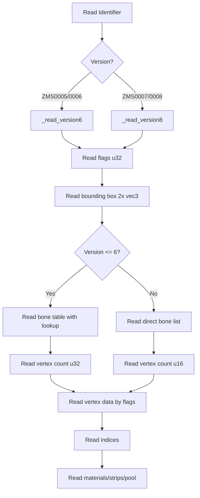

# Rose Online Blender 4.5 Importer - Python Implementation Analysis

**Phase 1 Audit Document**  
**Date:** 2026-02-16  
**Purpose:** Baseline analysis for cross-referencing with Rust Bevy 0.11 reference implementation

---

## Table of Contents

1. [Executive Summary](#executive-summary)
2. [Binary Parsing Infrastructure](#binary-parsing-infrastructure)
3. [Data Structure Modules](#data-structure-modules)
4. [Import Scripts](#import-scripts)
5. [Export Scripts](#export-scripts)
6. [Coordinate System Transformations](#coordinate-system-transformations)
7. [Potential Issues & Areas of Concern](#potential-issues--areas-of-concern)
8. [Cross-Reference Validation Points](#cross-reference-validation-points)

---

## Executive Summary

The `io_rose` plugin is a Blender 4.5 addon for importing Rose Online game assets. It supports multiple file formats:

| Format | Description | Parser Module | Import Script |
|--------|-------------|---------------|---------------|
| ZMS | 3D Mesh | [`rose/zms.py`](rose/zms.py) | [`import_zms.py`](import_zms.py) |
| ZMD | Skeleton/Rigging | [`rose/zmd.py`](rose/zmd.py) | [`import_zmd.py`](import_zmd.py) |
| ZSC | Scene Container | [`rose/zsc.py`](rose/zsc.py) | [`import_zsc.py`](import_zsc.py) |
| ZON | Zone/Map Data | [`rose/zon.py`](rose/zon.py) | [`import_map.py`](import_map.py) |
| HIM | Height Map | [`rose/him.py`](rose/him.py) | [`import_terrain.py`](import_terrain.py) |
| TIL | Tile Data | [`rose/til.py`](rose/til.py) | [`import_terrain.py`](import_terrain.py) |
| IFO | Object Placement | [`rose/ifo.py`](rose/ifo.py) | [`import_map.py`](import_map.py) |

---

## Binary Parsing Infrastructure

### [`rose/utils.py`](rose/utils.py:1) - Core Binary Reading Utilities

**Endianness:** All binary data uses **Little Endian** (`<` format specifier in struct)

**Struct Format Mapping:**

| Data Type | Struct Format | Bytes | Function |
|-----------|---------------|-------|----------|
| int8 | `<b` | 1 | [`read_i8()`](rose/utils.py:61) |
| uint8 | `<B` | 1 | [`read_u8()`](rose/utils.py:74) |
| int16 | `<h` | 2 | [`read_i16()`](rose/utils.py:65) |
| uint16 | `<H` | 2 | [`read_u16()`](rose/utils.py:78) |
| int32 | `<i` | 4 | [`read_i32()`](rose/utils.py:69) |
| uint32 | `<I` | 4 | [`read_u32()`](rose/utils.py:82) |
| float32 | `<f` | 4 | [`read_f32()`](rose/utils.py:87) |
| bool | `<?` | 1 | [`read_bool()`](rose/utils.py:92) |

**String Formats:**

| Format | Description | Function |
|--------|-------------|----------|
| Null-terminated | Read until `\x00` | [`read_str()`](rose/utils.py:97) |
| Fixed-length | Read N bytes, strip nulls | [`read_fstr(f, length)`](rose/utils.py:107) |
| BSTR | Length-prefixed (uint8 + data) | [`read_bstr()`](rose/utils.py:112) |

**Vector/Quaternion Reading:**

```python
# Vector2: x, y (2x float32)
def read_vector2_f32(f):  # Line 140

# Vector3: x, y, z (3x float32)  
def read_vector3_f32(f):  # Line 146

# Quaternion W,X,Y,Z order (Rose format)
def read_quat_wxyz(f):  # Line 201

# Quaternion X,Y,Z,W order (alternative)
def read_quat_xyzw(f):  # Line 209
```

**Data Classes:**

| Class | Fields | File Location |
|-------|--------|---------------|
| [`Vector2`](rose/utils.py:4) | x, y | utils.py:4 |
| [`Vector3`](rose/utils.py:12) | x, y, z | utils.py:12 |
| [`Color4`](rose/utils.py:29) | r, g, b, a | utils.py:29 |
| [`Quat`](rose/utils.py:39) | x, y, z, w | utils.py:39 |

---

## Data Structure Modules

### [`rose/zms.py`](rose/zms.py:1) - ZMS Mesh Format

**Supported Versions:** ZMS0005, ZMS0006, ZMS0007, ZMS0008

**Vertex Flags (Bitmask):**

```python
class VertexFlags(IntEnum):  # Line 4
    POSITION     = 2    # (1 << 1)
    NORMAL       = 4    # (1 << 2)
    COLOR        = 8    # (1 << 3)
    BONE_WEIGHT  = 16   # (1 << 4)
    BONE_INDEX   = 32   # (1 << 5)
    TANGENT      = 64   # (1 << 6)
    UV1          = 128  # (1 << 7)
    UV2          = 256  # (1 << 8)
    UV3          = 512  # (1 << 9)
    UV4          = 1024 # (1 << 10)
```

**Key Data Structures:**

| Class | Purpose | Key Fields |
|-------|---------|------------|
| [`Vertex`](rose/zms.py:16) | Single mesh vertex | position, normal, color, bone_weights[4], bone_indices[4], tangent, uv1-4 |
| [`ZMS`](rose/zms.py:29) | Complete mesh | identifier, version, flags, bounding_box_min/max, vertices[], indices[], bones[], materials[], strips[], pool |

**Version Differences:**

| Aspect | Version 5/6 | Version 7/8 |
|--------|-------------|-------------|
| Count types | uint32 | uint16 |
| Position scale | ÷100.0 | No scaling |
| Bone table | Lookup table with dummy indices | Direct list |
| Vertex ID prefix | Yes (uint32 before each vertex data) | No |
| Indices storage | uint32 per component | uint16 flat array |

**Parsing Flow:**



---

### [`rose/zmd.py`](rose/zmd.py:1) - ZMD Skeleton Format

**Data Structures:**

| Class | Purpose | Key Fields |
|-------|---------|------------|
| [`Bone`](rose/zmd.py:4) | Skeleton bone | parent_id, name, position (Vector3), rotation (Quat) |
| [`Dummy`](rose/zmd.py:12) | Attachment point | name, parent_id, position, rotation |
| [`ZMD`](rose/zmd.py:20) | Complete skeleton | bones[], dummies[] |

**Parsing Logic:**

1. Read 7-char format identifier (fixed string)
2. Read bone count (uint32)
3. For each bone:
   - parent_id (int32)
   - name (null-terminated string)
   - position (Vector3 float32) - **scaled by 0.01** (cm to m)
   - rotation (Quat WXYZ)
   - Force first bone parent_id = -1 (root)
4. Optional dummy objects (file position check)

**Potential Issue:** Line 49 forces first bone to be root regardless of file content.

---

### [`rose/zon.py`](rose/zon.py:1) - ZON Zone Format

**Block Types:**

```python
class BlockType:  # Line 3
    Info = 0      # Zone metadata
    Spawns = 1    # Spawn points
    Textures = 2  # Texture list
    Tiles = 3     # Tile definitions
    Economy = 4   # Economy settings
```

**Data Structures:**

| Class | Purpose |
|-------|---------|
| [`Position`](rose/zon.py:27) | Grid position with usage flag |
| [`Spawn`](rose/zon.py:38) | Spawn point with position and name |
| [`Tile`](rose/zon.py:46) | Tile layers, offsets, blending, rotation |
| [`Zon`](rose/zon.py:56) | Complete zone data |

**Parsing Strategy:** Block-based with offset table
1. Read block count
2. Read block headers (type + offset pairs)
3. Seek to each block offset and parse by type

---

### [`rose/til.py`](rose/til.py:1) - TIL Tile Format

**Data Structures:**

| Class | Purpose | Fields |
|-------|---------|--------|
| [`TilPatch`](rose/til.py:3) | Single tile patch | brush (i8), tile_index (i8), tile_set (i8), tile (i32) |
| [`Til`](rose/til.py:10) | Tile grid | width, length, tiles[][] |

**Parsing:** Simple 2D grid of TilPatch structures.

---

### [`rose/him.py`](rose/him.py:1) - HIM Height Map

**Data Structure:**

| Class | Purpose | Fields |
|-------|---------|--------|
| [`Him`](rose/him.py:4) | Height map | width, length, heights[][], max_height, min_height |

**Parsing:**
1. Read width (i32), length (i32)
2. Skip 8 bytes (grid_count + patch_scale)
3. Read height values as float32 grid
4. Track min/max heights

---

### [`rose/ifo.py`](rose/ifo.py:1) - IFO Object Placement

**Block Types:**

```python
class BlockType(IntEnum):  # Line 4
    DeprecatedMapInfo = 0
    DecoObject = 1
    Npc = 2
    CnstObject = 3
    SoundObject = 4
    EffectObject = 5
    AnimatedObject = 6
    DeprecatedWater = 7
    MonsterSpawn = 8
    WaterPlanes = 9
    Warp = 10
    CollisionObject = 11
    EventObject = 12
```

**Key Data Structures:**

| Class | Purpose |
|-------|---------|
| [`IfoObject`](rose/ifo.py:19) | Base object with transform |
| [`IfoMonsterSpawnPoint`](rose/ifo.py:39) | Monster spawn with basic/tactic spawns |
| [`IfoNpc`](rose/ifo.py:67) | NPC with AI and quest data |
| [`Ifo`](rose/ifo.py:73) | Complete IFO container |

---

### [`rose/zsc.py`](rose/zsc.py:1) - ZSC Scene Container

**Enums:**

```python
class BlendMode(IntEnum):  # Line 22
    NONE = 0, CUSTOM = 1, NORMAL = 2, LIGHTEN = 3

class GlowType(IntEnum):  # Line 29
    NONE = 0, NOTSET = 1, SIMPLE = 2, LIGHT = 3, 
    TEXTURE = 4, TEXTURELIGHT = 5, ALPHA = 6

class CollisionType(IntEnum):  # Line 39
    NONE = 0, SPHERE = 1, AXISALIGNEDBOUNDINGBOX = 2,
    ORIENTEDBOUNDINGBOX = 3, POLYGON = 4
```

**Data Structures:**

| Class | Purpose | Key Fields |
|-------|---------|------------|
| [`ZscMaterial`](rose/zsc.py:81) | Material definition | path, is_skin, alpha_enabled, two_sided, blend_mode, glow, etc. |
| [`ZscObjectPart`](rose/zsc.py:100) | Mesh part | mesh_id, material_id, position, rotation, scale, bone_index, parent |
| [`ZscObjectEffect`](rose/zsc.py:118) | Effect attachment | effect_id, effect_type, transform, parent |
| [`ZscObject`](rose/zsc.py:131) | Complete object | parts[], effects[] |
| [`Zsc`](rose/zsc.py:140) | Scene container | meshes[], materials[], effects[], objects[] |

**Property-Based Parsing:** Uses property ID + size pairs for flexible part/effect data.

---

## Import Scripts

### [`import_zms.py`](import_zms.py:1) - Mesh Import

**Blender API Usage:**

| API | Purpose | Location |
|-----|---------|----------|
| `bpy.data.meshes.new()` | Create mesh | Line 109 |
| `mesh.from_pydata()` | Set vertices/faces | Line 133 |
| `mesh.normals_split_custom_set()` | Set custom normals | Line 137 |
| `mesh.uv_layers.new()` | Create UV layers | Lines 140-147 |
| `bpy.data.materials.new()` | Create material | Line 173 |
| `mat.use_nodes` | Enable node system | Line 174 |
| `ShaderNodeTexImage` | Texture node | Line 178 |

**Coordinate Conversion:**

```python
# Line 115: Rose (x, y, z) -> Blender (x, z, -y)
verts.append((v.position.x, v.position.z, -v.position.y))
```

**UV Handling:** V coordinate is flipped (`1 - v`)

**Vertex Groups:** Created for bone weights with naming convention `zms_bone_{i}`

**Metadata Storage:** ZMS data stored in object properties for round-trip export:
- `zms_version`, `zms_identifier`, `zms_materials`, `zms_strips`, `zms_pool`, `zms_bones`

---

### [`import_zmd.py`](import_zmd.py:1) - Skeleton Import

**Blender API Usage:**

| API | Purpose | Location |
|-----|---------|----------|
| `bpy.data.armatures.new()` | Create armature | Line 52 |
| `bpy.ops.object.mode_set(mode='EDIT')` | Enter edit mode | Line 63 |
| `armature.edit_bones.new()` | Create bones | Line 81 |

**World Transform Calculation:**

```python
# Lines 85-106: Build world transforms hierarchically
for idx, rose_bone in enumerate(zmd.bones):
    if rose_bone.parent_id == -1:
        # Root: local = world
        world_positions.append(pos)
        world_rotations.append(rot)
    else:
        # Child: transform by parent world
        world_pos = parent_pos + (parent_rot @ pos)
        world_rot = parent_rot @ rot
```

---

### [`import_zsc.py`](import_zsc.py:1) - Scene Import

**Key Features:**
- Loads ZSC + corresponding IFO for object placement
- Caches materials and meshes for instancing
- Creates parent empties for object hierarchy

**Coordinate Conversion:**

```python
# Line 154: Position with world offset
bx, by, bz = convert_rose_position_to_blender(pos.x, pos.y, pos.z)
parent_empty.location = (bx + 52.0, bz + 52.0, by + 52.0)

# Line 161: Quaternion conversion
parent_empty.rotation_quaternion = (rot.w, rot.x, -rot.z, rot.y)
```

---

### [`import_map.py`](import_map.py:1) - Full Map Import

**Complex multi-file import process:**

1. **File Discovery:**
   - Find 3DDATA root directory
   - Load ZON, HIM, TIL, IFO files
   - Auto-discover CNST/DECO ZSC files

2. **Terrain Generation:**
   - Create unified mesh from multiple tiles
   - Handle inter-tile connections
   - Apply materials based on tile texture indices

3. **Object Spawning:**
   - Pre-collect used object IDs
   - Batch create materials
   - Instance meshes with transforms

**World Offset:** 52.0m (5200cm) applied to X, Y, Z

**Grid Scale:** `zon.grid_size / 100.0` (cm to m)

---

### [`import_terrain.py`](import_terrain.py:1) - Terrain-Only Import

Simplified version of [`import_map.py`](import_map.py:1) that:
- Only loads terrain mesh
- Skips CNST/DECO objects
- Same coordinate transformation logic

---

## Export Scripts

### [`export_zms.py`](export_zms.py:1) - Mesh Export

**Key Features:**

1. **Version Detection:** Reads `zms_version` from object properties
2. **Transform Application:** Uses bmesh to apply world matrix
3. **UV Splitting:** Splits vertices by unique UV coordinates
4. **Metadata Restoration:** Preserves original materials, strips, pool, bones

**Vertex Splitting Logic:**

```python
# Lines 244-346: Split vertices by UV/color combinations
for tri in mesh.loop_triangles:
    for loop_idx in tri.loops:
        # Build key from vertex index + UV coords + colors
        key = tuple(uv_key)
        if key not in vertex_map:
            # Create new vertex with unique UV/color combination
```

**Validation Checks:**
- Max 65,535 vertices (uint16 limit)
- Max 65,535 triangles
- Face index bounds checking

---

## Coordinate System Transformations

### Rose Online Coordinate System
- **X:** Right
- **Y:** Up  
- **Z:** Forward (towards camera)
- **Units:** Centimeters

### Blender Coordinate System
- **X:** Right
- **Y:** Forward
- **Z:** Up
- **Units:** Meters

### Transformation Formula

```python
# From utils.py:261
def convert_rose_position_to_blender(x, y, z):
    return (x / 100.0, z / 100.0, -y / 100.0)
```

| Rose (cm) | Blender (m) |
|-----------|-------------|
| X | X / 100 |
| Y | -Z / 100 |
| Z | Y / 100 |

### Quaternion Conversion

```python
# Rose W,X,Y,Z -> Blender W,X,-Z,Y
blender_quat = (rot.w, rot.x, -rot.z, rot.y)
```

### World Offset
- **52.0 meters** (5200cm) added to X, Y, Z for object positioning
- Aligns with terrain coordinate system

---

## Potential Issues & Areas of Concern

### 1. Version Handling

**Issue:** [`zmd.py:49`](rose/zmd.py:49) forces first bone parent_id to -1
```python
if i == 0:
    bone.parent_id = -1
```
**Impact:** May override valid file data if first bone isn't actually root.

### 2. Coordinate System Inconsistencies

**Issue:** Multiple quaternion conversion patterns used:
- [`import_zsc.py:139`](import_zsc.py:139): `(rot.x, rot.z, -rot.y, rot.w)`
- [`import_zsc.py:161`](import_zsc.py:161): `(rot.w, rot.x, -rot.z, rot.y)`
- [`import_map.py:1013`](import_map.py:1013): Hardcoded `Quaternion((-0.5, -0.5, 0.5, 0.5))`

**Impact:** Objects may have incorrect rotations depending on import path.

### 3. Hardcoded Values

| Location | Value | Purpose |
|----------|-------|---------|
| [`import_map.py:568`](import_map.py:568) | 52.0 | World offset |
| [`import_map.py:1013`](import_map.py:1013) | `(-0.5, -0.5, 0.5, 0.5)` | Fixed rotation |
| [`import_zsc.py:156`](import_zsc.py:156) | 52.0 | World offset |

**Impact:** May not work correctly for all map types or coordinate systems.

### 4. Error Handling

**Issue:** Silent failures in several places:
- [`import_map.py:636`](import_map.py:636): `except Exception as e: pass`
- [`zmd.py:81`](rose/zmd.py:81): Catches all exceptions for dummy reading

**Impact:** Import failures may go unnoticed.

### 5. uint16 Limits

**Issue:** ZMS format uses uint16 for vertex/face counts (max 65,535)
- [`export_zms.py:75`](export_zms.py:75) validates this
- High-poly meshes will fail

### 6. Bone Index Mapping

**Issue:** Complex bone index mapping between:
- ZMS bone table (v5/6)
- Direct bone list (v7/8)
- Blender vertex groups

**Validation Needed:** Ensure bone indices correctly round-trip through import/export.

### 7. UV Coordinate Handling

**Issue:** V coordinate flipping (`1 - v`) applied inconsistently:
- Import: [`import_zms.py:155`](import_zms.py:155)
- Export: [`export_zms.py:304`](export_zms.py:304)

**Impact:** May cause inverted textures on round-trip.

---

## Cross-Reference Validation Points

When comparing with Rust Bevy implementation, verify:

### Binary Parsing

| Check | File | Line | Description |
|-------|------|------|-------------|
| 1 | [`zms.py`](rose/zms.py:109) | 109 | Version 5/6 flags read as u32 |
| 2 | [`zms.py`](rose/zms.py:212) | 212 | Version 7/8 bone count as u16 |
| 3 | [`zmd.py`](rose/zmd.py:43) | 43 | Quaternion read order (WXYZ) |
| 4 | [`zsc.py`](rose/zsc.py:196) | 196 | Quaternion read order (WXYZ then XYZW swap) |
| 5 | [`zon.py`](rose/zon.py:135) | 135 | Spawn position Z before Y |

### Coordinate Transforms

| Check | File | Line | Description |
|-------|------|------|-------------|
| 1 | [`utils.py`](rose/utils.py:261) | 261 | Position: (x, z, -y) / 100 |
| 2 | [`import_zms.py`](import_zms.py:115) | 115 | Mesh vertex conversion |
| 3 | [`import_zms.py`](import_zms.py:122) | 122 | Normal vector conversion |
| 4 | [`import_map.py`](import_map.py:679) | 679 | Terrain vertex calculation |
| 5 | [`import_zsc.py`](import_zsc.py:139) | 139 | Quaternion conversion |

### Data Structures

| Check | File | Line | Description |
|-------|------|------|-------------|
| 1 | [`zms.py`](rose/zms.py:21) | 21 | bone_weights as vec4 (4x float) |
| 2 | [`zms.py`](rose/zms.py:22) | 22 | bone_indices as 4-element array |
| 3 | [`zsc.py`](rose/zsc.py:98) | 98 | Material alpha as float32 |
| 4 | [`ifo.py`](rose/ifo.py:100) | 100 | Object rotation as Quat XYZW |

### Algorithm Verification

| Check | File | Description |
|-------|------|-------------|
| 1 | [`import_zmd.py:85`](import_zmd.py:85) | Hierarchical world transform calculation |
| 2 | [`import_map.py:656`](import_map.py:656) | Inter-tile face generation |
| 3 | [`export_zms.py:244`](export_zms.py:244) | UV-based vertex splitting |
| 4 | [`import_map.py:799`](import_map.py:799) | Material index assignment per face |

---

## File Summary

| File | Lines | Purpose |
|------|-------|---------|
| [`rose/utils.py`](rose/utils.py) | 277 | Binary I/O utilities, data classes |
| [`rose/zms.py`](rose/zms.py) | 279 | ZMS mesh parsing (v5-v8) |
| [`rose/zmd.py`](rose/zmd.py) | 83 | ZMD skeleton parsing |
| [`rose/zon.py`](rose/zon.py) | 179 | ZON zone/map parsing |
| [`rose/til.py`](rose/til.py) | 36 | TIL tile data parsing |
| [`rose/him.py`](rose/him.py) | 33 | HIM height map parsing |
| [`rose/ifo.py`](rose/ifo.py) | 216 | IFO object placement parsing |
| [`rose/zsc.py`](rose/zsc.py) | 362 | ZSC scene container parsing |
| [`import_zms.py`](import_zms.py) | 197 | Mesh import operator |
| [`import_zmd.py`](import_zmd.py) | 155 | Skeleton import operator |
| [`import_zsc.py`](import_zsc.py) | 354 | Scene import operator |
| [`import_map.py`](import_map.py) | 1177 | Full map import operator |
| [`import_terrain.py`](import_terrain.py) | 546 | Terrain-only import operator |
| [`export_zms.py`](export_zms.py) | 576 | Mesh export operator |

---

*End of Analysis Document*
